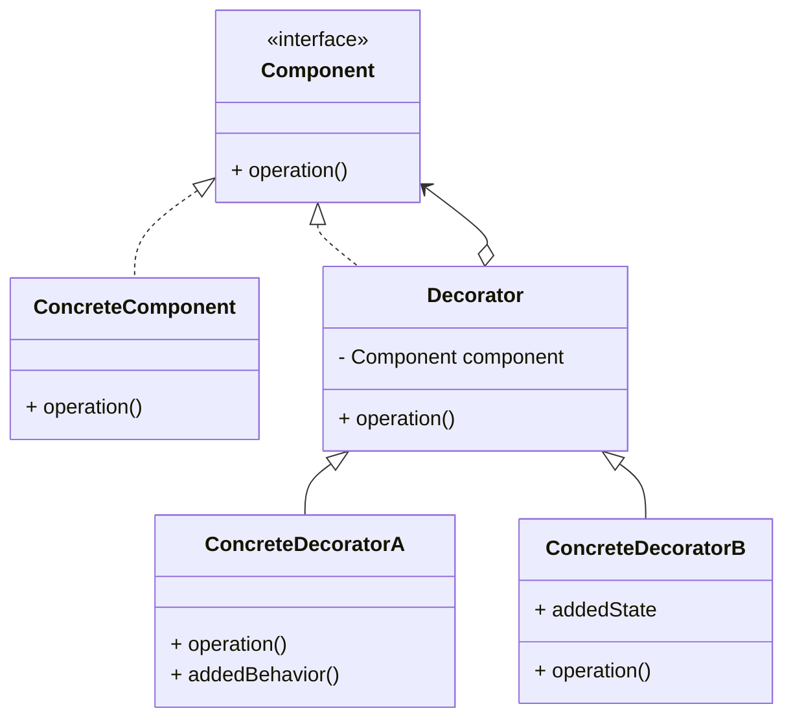
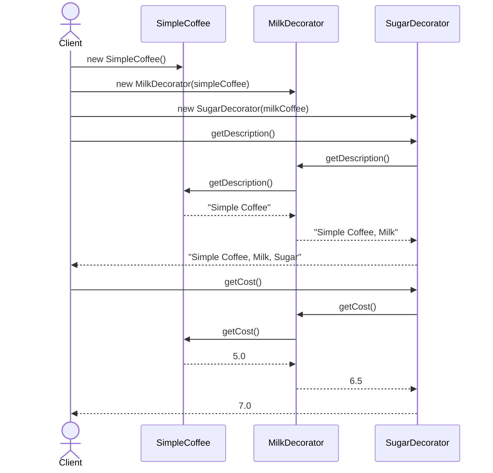

# Decorator (데코레이터) 패턴

객체에 동적으로 새로운 기능을 추가할 수 있게 하는 패턴입니다. 상속 대신 조합을 사용하여 기능을 확장합니다.

## 의도
- 동적 기능 확장: 런타임에 객체의 행동을 변경하거나 확장
- 클래스 폭발 방지: 모든 기능 조합에 대한 클래스 생성 없이 유연한 구성
- 단일 책임 원칙: 각 데코레이터는 하나의 기능만 담당
- 개방-폐쇄 원칙: 기존 코드 수정 없이 새로운 기능 추가

## 구조



## 예시: Coffee 주문 시스템

커피에 다양한 토핑(우유, 설탕 등)을 조합하여 주문하는 시스템입니다.



구성 요소
- `Coffee`: 기본 인터페이스, `getDescription()`과 `getCost()` 메소드 정의
- `SimpleCoffee`: 기본 커피 구현체
- `CoffeeDecorator`: 데코레이터 기본 클래스, Coffee 객체를 포함
- `MilkDecorator`, `SugarDecorator`: 구체적인 데코레이터, 각각 우유와 설탕 기능 추가

## 문제점과 해결

### 데코레이터 패턴 적용 전 문제점
- **클래스 폭발**: n개의 옵션이 있을 때 2^n개의 클래스 필요
  ```java
  // 우유, 설탕, 휘핑크림 옵션이 있다면...
  CoffeeWithMilk, CoffeeWithSugar, CoffeeWithWhippedCream,
  CoffeeWithMilkAndSugar, CoffeeWithMilkAndWhippedCream,
  CoffeeWithSugarAndWhippedCream, CoffeeWithMilkAndSugarAndWhippedCream
  ```
- **코드 중복**: 각 클래스에서 기본 로직이 반복됨
- **유연성 부족**: 런타임에 기능 추가/제거 불가능
- **유지보수 어려움**: 새 옵션 추가 시 모든 조합 클래스 생성 필요

### 데코레이터 패턴 적용 후 개선점
- **조합을 통한 확장**: 기본 객체에 데코레이터를 겹겹이 감싸서 기능 확장
- **동적 구성**: 런타임에 필요한 기능만 선택적으로 추가
- **코드 재사용**: 각 데코레이터는 독립적이며 다양한 조합에 재사용 가능
- **확장성**: 새로운 데코레이터 추가가 기존 코드에 영향 없음

```java
// 유연한 조합 가능
Coffee coffee = new SugarDecorator(
    new MilkDecorator(
        new SimpleCoffee()
    )
);
```

관련 경로
- `src/structural/decorator/problem/coffee/` - 클래스 폭발 문제 예시
- `src/structural/decorator/resolve/coffee/` - 데코레이터 패턴 적용

## 실제 사용 예시
- **Java I/O Stream**: `BufferedReader(new FileReader(file))`
- **Spring AOP**: 메소드 실행 전후에 부가 기능 추가
- **웹 프레임워크**: HTTP 요청/응답에 인증, 로깅, 캐싱 등 기능 추가

## 적용 팁
- **인터페이스 일관성**: 데코레이터와 원본 객체가 같은 인터페이스 구현
- **투명성**: 클라이언트는 데코레이터 사용 여부를 모르게 설계
- **단일 책임**: 각 데코레이터는 하나의 기능만 담당
- **과도한 사용 주의**: 너무 많은 데코레이터는 디버깅과 이해를 어렵게 만듦
- **순서 의존성**: 데코레이터 적용 순서가 결과에 영향을 줄 수 있음을 고려