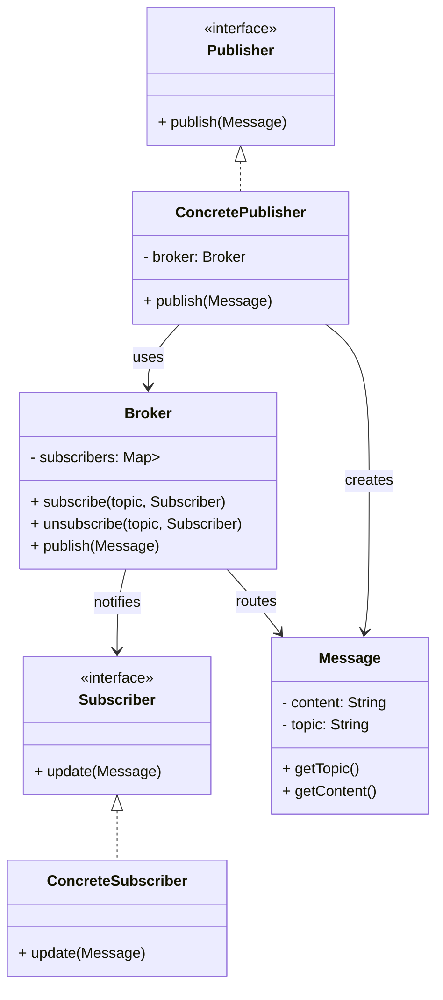
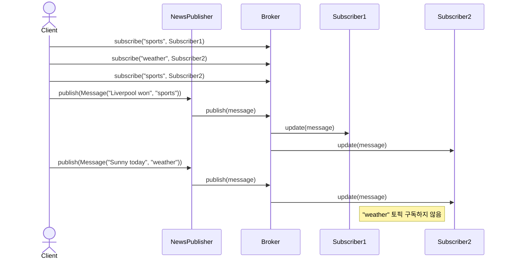
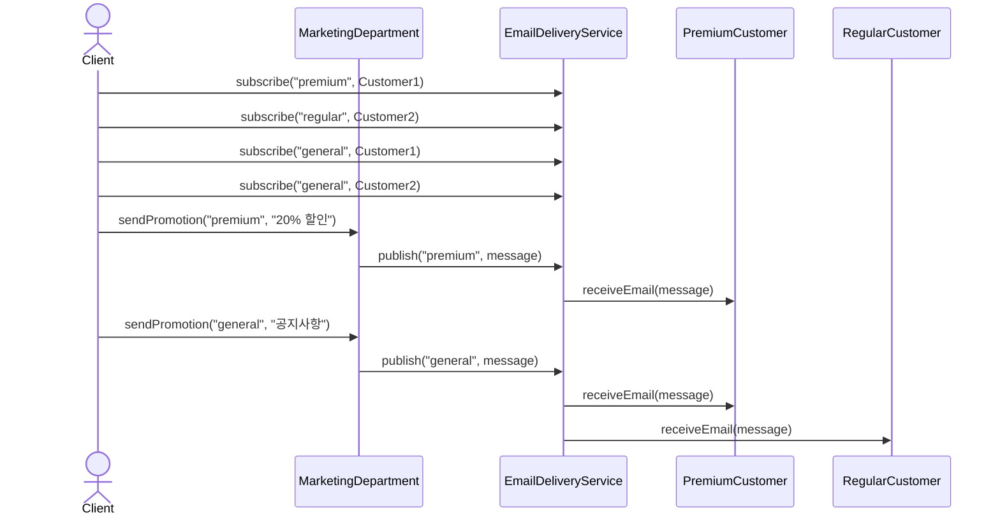

# Publisher-Subscriber (발행-구독) 패턴

발행자(Publisher)와 구독자(Subscriber) 간에 비동기 메시지 전달을 위한 메시징 패턴으로, 중간 매개체(Broker)를 통해 느슨한 결합을 제공하는 패턴입니다.

## 의도
- 메시지 발행자와 구독자 간의 완전한 분리
- 토픽 기반 메시지 라우팅으로 유연한 통신
- 시스템 간 비동기 통신 및 확장성 제공
- 일대다, 다대다 통신 패턴 지원

## Observer vs Publisher-Subscriber

| 특징 | Observer | Publisher-Subscriber |
|------|----------|---------------------|
| **결합도** | Subject-Observer 직접 연결 | Broker를 통한 완전 분리 |
| **통신방식** | 동기적 | 비동기적 |
| **메시지 라우팅** | 모든 Observer에게 전달 | 토픽별 선택적 전달 |
| **확장성** | 제한적 | 높음 |
| **복잡도** | 단순 | 상대적으로 복잡 |

## 구조

## 예시 1: 뉴스 배급 시스템 (news)

구성 요소
- `Publisher` 인터페이스: 메시지 발행자의 공통 인터페이스
- `NewsPublisher`: 뉴스를 발행하는 구체적인 발행자
- `Broker`: 토픽별로 메시지를 라우팅하는 중개자
- `Subscriber` 인터페이스: 메시지 구독자의 공통 인터페이스
- `NewsSubscriber`: 뉴스를 수신하는 구체적인 구독자
- `Message`: 토픽과 내용을 포함하는 메시지 객체

관련 경로 (resolve)
- `src/behavioral/publisherSubscriber/resolve/news/Publisher.java`
- `src/behavioral/publisherSubscriber/resolve/news/NewsPublisher.java`
- `src/behavioral/publisherSubscriber/resolve/news/Broker.java`
- `src/behavioral/publisherSubscriber/resolve/news/Subscriber.java`
- `src/behavioral/publisherSubscriber/resolve/news/NewsSubscriber.java`
- `src/behavioral/publisherSubscriber/resolve/news/Message.java`
- `src/behavioral/publisherSubscriber/resolve/news/Client.java`

## 예시 2: 마케팅 시스템 (marketing)

구성 요소
- `MarketingDepartment`: 고객 등급별 프로모션을 발행
- `EmailDeliveryService`: 이메일 전송을 담당하는 브로커 역할
- `Customer` 인터페이스: 고객의 공통 인터페이스
- `IndividualCustomer`: 개별 고객 구현체

관련 경로 (resolve)
- `src/behavioral/publisherSubscriber/resolve/marketing/MarketingDepartment.java`
- `src/behavioral/publisherSubscriber/resolve/marketing/EmailDeliveryService.java`
- `src/behavioral/publisherSubscriber/resolve/marketing/Customer.java`
- `src/behavioral/publisherSubscriber/resolve/marketing/IndividualCustomer.java`
- `src/behavioral/publisherSubscriber/resolve/marketing/Client.java`

## Problem vs Resolve
- Problem (직접 의존): `src/behavioral/publisherSubscriber/problem/`
  - 문제점: 발행자가 구독자 목록을 직접 관리하여 강결합. 새로운 토픽 추가 시 클래스 수정 필요. 토픽별로 하드코딩된 메소드들로 확장성 부족.
- Resolve (발행-구독 패턴): 위 '관련 경로 (resolve)' 참고
  - 장점: Broker를 통한 완전한 분리. 토픽 기반 동적 라우팅. 런타임에 새로운 토픽 추가 가능. OCP 준수로 확장성 확보.

## 패턴 변형
- **Event Bus**: 중앙 집중식 이벤트 버스를 통한 메시지 라우팅
- **Message Queue**: 지속성 있는 메시지 큐를 통한 비동기 처리
- **Topic Exchange**: 복잡한 라우팅 규칙을 지원하는 토픽 교환
- **Request-Reply**: 요청-응답 패턴과 결합한 동기적 통신

## 적용 사례
- **마이크로서비스**: 서비스 간 비동기 통신
- **이벤트 기반 아키텍처**: 도메인 이벤트 전파
- **실시간 알림**: 푸시 알림, 이메일 발송
- **로깅 시스템**: 분산 로그 수집 및 처리
- **IoT 시스템**: 센서 데이터 수집 및 배포

## 적용 팁
- Apache Kafka, RabbitMQ 등 메시지 브로커 활용 고려
- 메시지 직렬화/역직렬화 전략 수립
- 메시지 순서 보장이 필요한 경우 파티셔닝 고려
- Dead Letter Queue를 통한 실패 메시지 처리
- 메시지 중복 처리를 위한 멱등성 보장
- 백프레셔(Backpressure) 처리 메커니즘 고려

## 주의사항
- 메시지 전달 보장 수준 정의 (at-most-once, at-least-once, exactly-once)
- 네트워크 분할 상황에서의 동작 정의
- 메모리 누수 방지를 위한 구독 해제 메커니즘
- 메시지 크기 및 처리량 제한 고려