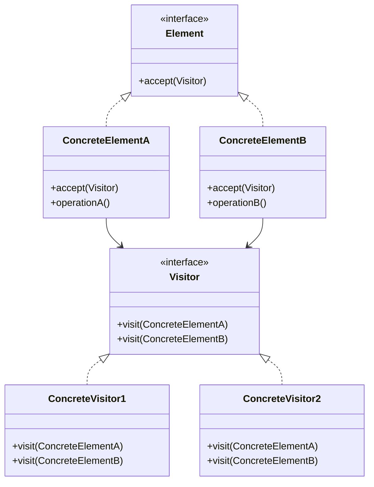
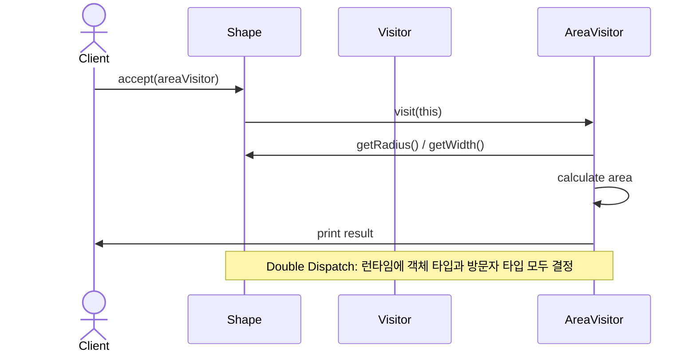

# Visitor (방문자) 패턴

객체 구조를 변경하지 않고 새로운 연산을 추가할 수 있게 해주는 패턴입니다. 연산을 수행할 객체로부터 알고리즘을 분리하여 개방-폐쇄 원칙을 준수합니다.

## 의도
- 연산 추가 용이성: 기존 클래스 구조를 변경하지 않고 새로운 연산 추가 가능
- 관심사 분리: 도메인 로직과 연산 로직을 분리하여 단일 책임 원칙 준수
- 타입 안전성: 컴파일 타임에 연산의 타입 안전성 보장

## 구조



## 예시: 도형 계산 시스템

상황
- 다양한 도형(Circle, Rectangle)에 대해 여러 연산(면적 계산, 둘레 계산) 수행
- 새로운 연산 추가 시 기존 도형 클래스들을 수정하고 싶지 않음
- 각 연산별로 로직을 분리하여 관리하고 싶음

흐름(Resolve)


관련 경로
- Resolve
  - `src/behavioral/visitor/resolve/Visitor.java`
  - `src/behavioral/visitor/resolve/Shape.java`
  - `src/behavioral/visitor/resolve/AreaVisitor.java`
  - `src/behavioral/visitor/resolve/PerimeterVisitor.java`
  - `src/behavioral/visitor/resolve/Circle.java`
  - `src/behavioral/visitor/resolve/Rectangle.java`
  - `src/behavioral/visitor/resolve/Client.java`
- Problem
  - `src/behavioral/visitor/problem/Shape.java`
  - `src/behavioral/visitor/problem/Circle.java`
  - `src/behavioral/visitor/problem/Rectangle.java`
  - `src/behavioral/visitor/problem/Client.java`

문제점(Problem)
- 새로운 연산 추가 시 모든 도형 클래스 수정 필요 (개방-폐쇄 원칙 위배)
- 도메인 로직(도형 정보)과 연산 로직(계산)이 혼재 (단일 책임 원칙 위배)
- 모든 도형이 모든 연산을 구현해야 함 (불필요한 의존성)
- 연산별 코드가 여러 클래스에 분산되어 관리가 어려움

개선점(Resolve)
- 새로운 연산 추가 시 새로운 Visitor만 구현하면 됨
- 도형 클래스는 자신의 속성 관리에만 집중
- 연산별로 코드가 하나의 Visitor 클래스에 집중되어 관리 용이
- Double Dispatch를 통한 타입 안전한 연산 수행

## Double Dispatch

Visitor 패턴의 핵심 메커니즘:

1. **첫 번째 Dispatch**: `shape.accept(visitor)` - 실제 도형 타입 결정
2. **두 번째 Dispatch**: `visitor.visit(this)` - 실제 방문자 타입 결정

```java
// 컴파일 타임에는 Shape, 런타임에는 Circle
Shape shape = new Circle(5.0);
// 컴파일 타임에는 Visitor, 런타임에는 AreaVisitor  
Visitor visitor = new AreaVisitor();

shape.accept(visitor); // Double dispatch 시작
// → Circle.accept(AreaVisitor) 호출
// → AreaVisitor.visit(Circle) 호출
```

## 언제 사용할까?

**적합한 경우:**
- 객체 구조는 안정적이지만 연산은 자주 추가되는 경우
- 연관되지 않은 연산들을 관련 객체들에서 제거하고 싶을 때
- 객체 구조의 클래스들이 서로 다른 인터페이스를 가질 때

**부적합한 경우:**
- 객체 구조가 자주 변경되는 경우 (새 Element 추가 시 모든 Visitor 수정 필요)
- 연산보다 객체 타입이 더 자주 추가되는 경우

## Strategy vs Visitor

| 특징 | Strategy | Visitor |
|------|----------|---------|
| 목적 | 알고리즘 교체 | 새로운 연산 추가 |
| 구조 | 단일 객체의 행동 변경 | 객체 계층구조에 연산 추가 |
| Dispatch | Single Dispatch | Double Dispatch |
| 확장성 | 새 전략 추가 쉬움 | 새 연산 추가 쉬움 |

## 적용 팁
- 객체 구조가 복잡하고 안정적일 때 가장 효과적
- AST(Abstract Syntax Tree) 처리, 컴파일러 설계에서 널리 사용
- 연산이 여러 타입의 객체를 다뤄야 할 때 유용
- Element 인터페이스 변경을 최소화하여 기존 코드 안정성 유지