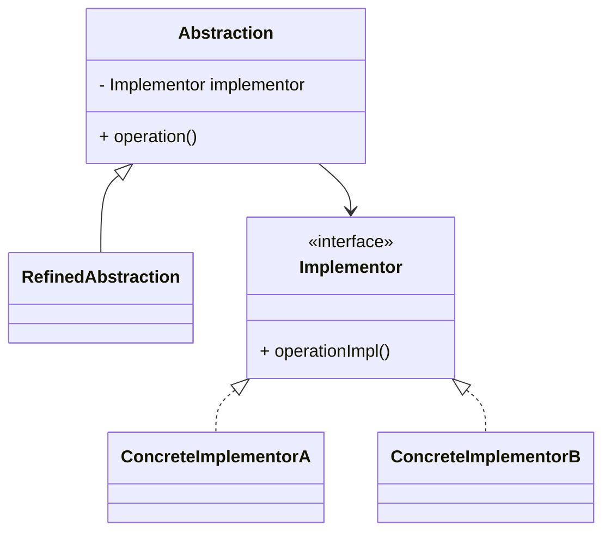
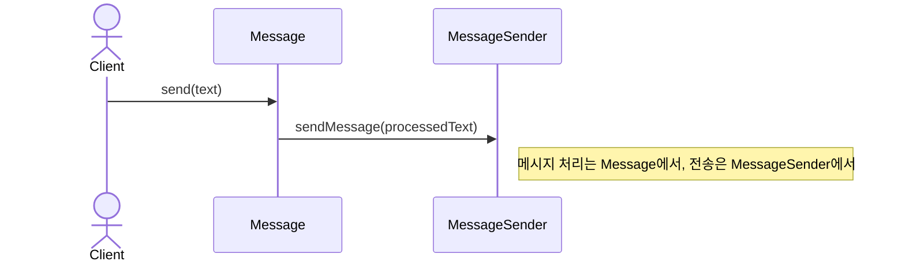
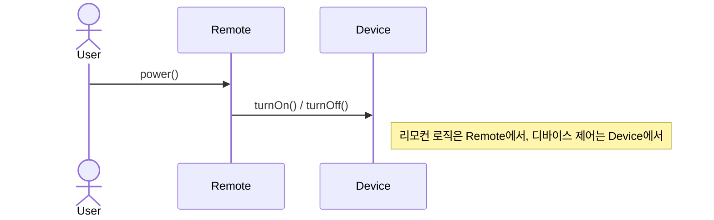

# Bridge (브릿지) 패턴

추상화(Abstraction)와 구현(Implementation)을 분리하여 둘을 독립적으로 다양화할 수 있도록 하는 패턴입니다.

## 의도
- 추상화와 구현을 분리하여 독립적 확장 가능
- 런타임에 구현 교체로 유연성 제공  
- 조합 폭발(N×M 클래스) 문제 해결
- 구현 세부사항을 클라이언트로부터 숨김

## 구조

## 예시 1: 메시지 전송 시스템 (sender)

구성 요소
- `Message` 추상화: 메시지 타입별 전송 방식 정의
- `TextMessage` / `EncryptMessage`: 구체적인 메시지 타입들
- `MessageSender` 인터페이스: 전송 방식 구현체 정의
- `EmailSender` / `SMSSender`: 구체적인 전송 방식들

관련 경로 (resolve)
- `src/structural/bridge/resolve/sender/Message.java`
- `src/structural/bridge/resolve/sender/TextMessage.java`
- `src/structural/bridge/resolve/sender/EncryptMessage.java`
- `src/structural/bridge/resolve/sender/MessageSender.java`
- `src/structural/bridge/resolve/sender/EmailSender.java`
- `src/structural/bridge/resolve/sender/SMSSender.java`

## 예시 2: 리모컨과 디바이스 (tv)

구성 요소
- `Remote` 추상화: 리모컨의 기본 동작 정의
- `BasicRemote` / `AdvancedRemote`: 구체적인 리모컨 타입들
- `Device` 인터페이스: 디바이스 조작 방식 정의
- `TV` / `Radio`: 구체적인 디바이스들

관련 경로 (resolve)
- `src/structural/bridge/resolve/tv/Remote.java`
- `src/structural/bridge/resolve/tv/BasicRemote.java`
- `src/structural/bridge/resolve/tv/AdvancedRemote.java`
- `src/structural/bridge/resolve/tv/Device.java`
- `src/structural/bridge/resolve/tv/TV.java`
- `src/structural/bridge/resolve/tv/Radio.java`

## Problem vs Resolve
- Problem (조합 폭발): `src/structural/bridge/problem/`
  - 문제점: 메시지 타입 N개 × 전송 방식 M개 = N×M개 클래스 필요. 추상화와 구현이 강결합되어 독립적 확장 불가능.
- Resolve (브릿지 패턴): 위 '관련 경로 (resolve)' 참고
  - 장점: 추상화와 구현을 분리하여 각각 독립적으로 확장 가능. 조합 수만큼 클래스를 만들 필요 없음.

## 적용 팁
- 추상화는 구현에 위임하고, 구현은 플랫폼별 세부사항에 집중
- 런타임에 구현 교체가 필요한 경우 유용 (의존성 주입과 함께 활용)
- 플랫폼 독립적인 API 설계 시 효과적
- 상속보다 컴포지션을 통해 유연성 확보

