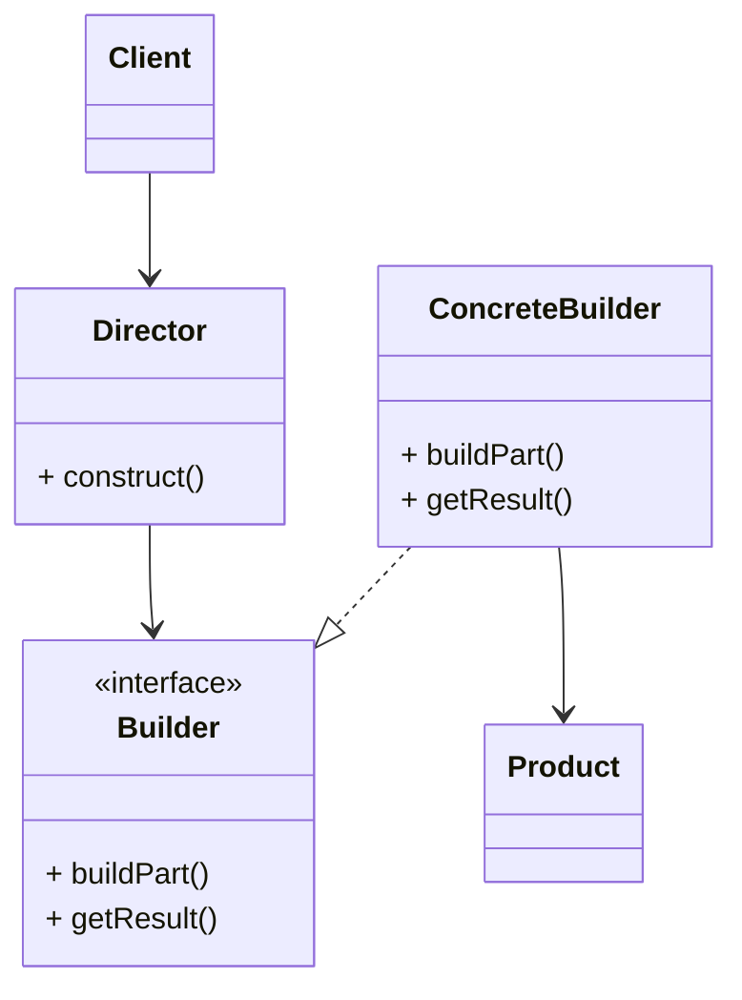
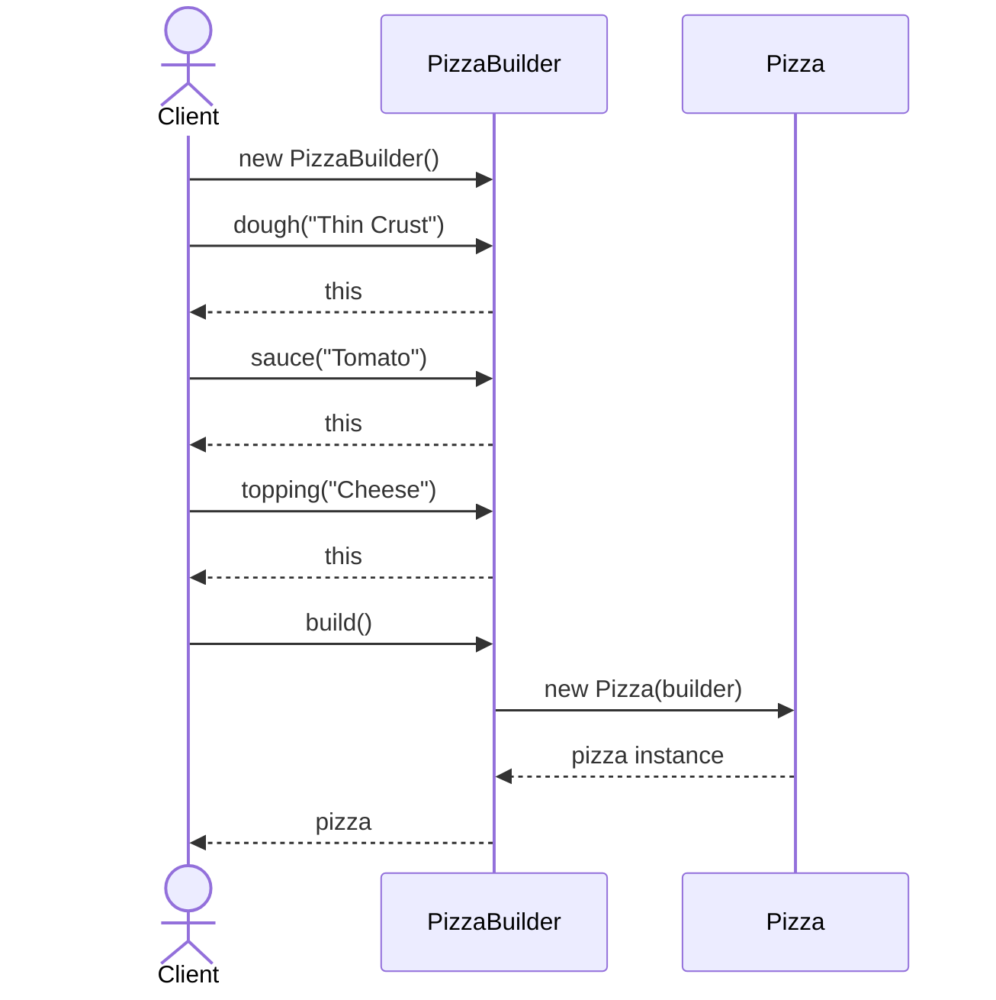
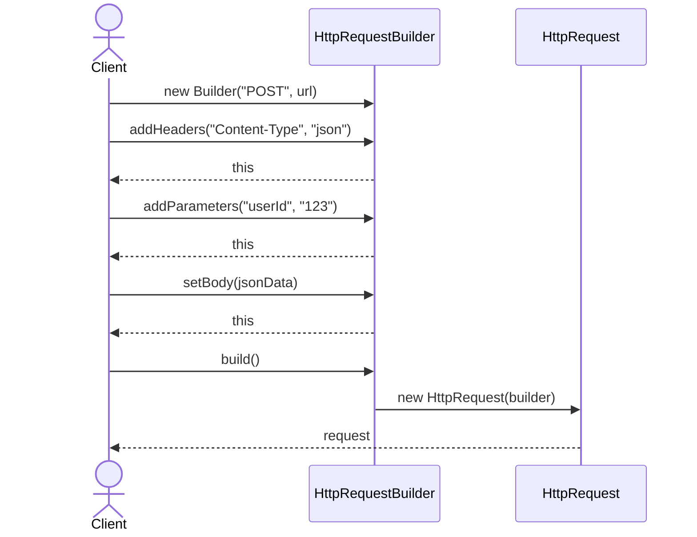

# Builder (빌더) 패턴

복잡한 객체의 생성 과정을 단계별로 분리하여, 동일한 생성 과정에서 서로 다른 표현의 객체를 만들 수 있게 하는 패턴입니다.

## 의도
- 복잡한 객체 생성 단순화: 매개변수가 많은 생성자 대신 단계별 설정 제공
- 불완전한 객체 상태 방지: 빌더를 통해 완전한 객체만 생성 보장
- 가독성 향상: 메소드 체이닝으로 직관적인 객체 생성 코드 작성
- 선택적 매개변수 지원: 필요한 속성만 설정하여 유연한 객체 생성

## 구조

## 예시 1: Pizza 생성

여러 재료를 조합하여 다양한 피자를 만드는 경우입니다.

구성 요소
- `PizzaBuilder`: 피자의 각 구성 요소(도우, 소스, 토핑)를 단계별로 설정
- `Pizza`: 최종 생성되는 불변 객체, private 생성자로 빌더를 통해서만 생성 가능
- 메소드 체이닝: 각 설정 메소드가 빌더 자신을 반환하여 연속 호출 가능

## 예시 2: HTTP Request 생성

복잡한 HTTP 요청 객체를 만드는 경우입니다.

구성 요소
- `HttpRequest.Builder`: HTTP 요청의 헤더, 파라미터, 바디를 단계적으로 설정
- `HttpRequest`: 완전한 HTTP 요청 객체, 빌더를 통해서만 생성 가능
- 필수/선택 구분: 생성자에서 필수 값(method, url)을 받고, 나머지는 선택적 설정

관련 경로
- `src/creational/builder/problem/pizza/` - 생성자 폭발 문제 예시
- `src/creational/builder/resolve/pizza/` - 빌더 패턴 적용
- `src/creational/builder/problem/http/` - 복잡한 객체 생성 문제
- `src/creational/builder/resolve/http/` - 빌더 패턴 해결

## 문제점과 해결

### 빌더 패턴 적용 전 문제점
- **생성자 폭발**: 다양한 조합을 위해 여러 생성자 필요
- **매개변수 순서 혼동**: 많은 매개변수로 인한 실수 발생
- **불완전한 객체**: setter 사용 시 일시적으로 불완전한 상태 존재
- **가독성 저하**: 긴 생성자 호출 코드의 의미 파악 어려움

### 빌더 패턴 적용 후 개선점
- **단계별 설정**: 명확한 메소드명으로 각 속성의 의미 명시
- **메소드 체이닝**: 연속적이고 직관적인 객체 생성 코드
- **불변 객체**: 완전한 객체만 생성되어 안전성 보장
- **선택적 설정**: 필요한 속성만 설정하여 유연성 제공

## 적용 팁
- **필수 vs 선택**: 빌더 생성자에는 필수 매개변수만, 나머지는 선택적 설정 메소드로
- **불변성 보장**: 최종 객체는 불변으로 만들어 안전성 확보
- **검증 로직**: build() 메소드에서 유효성 검사 수행
- **과도한 사용 주의**: 단순한 객체에는 오버엔지니어링이 될 수 있음