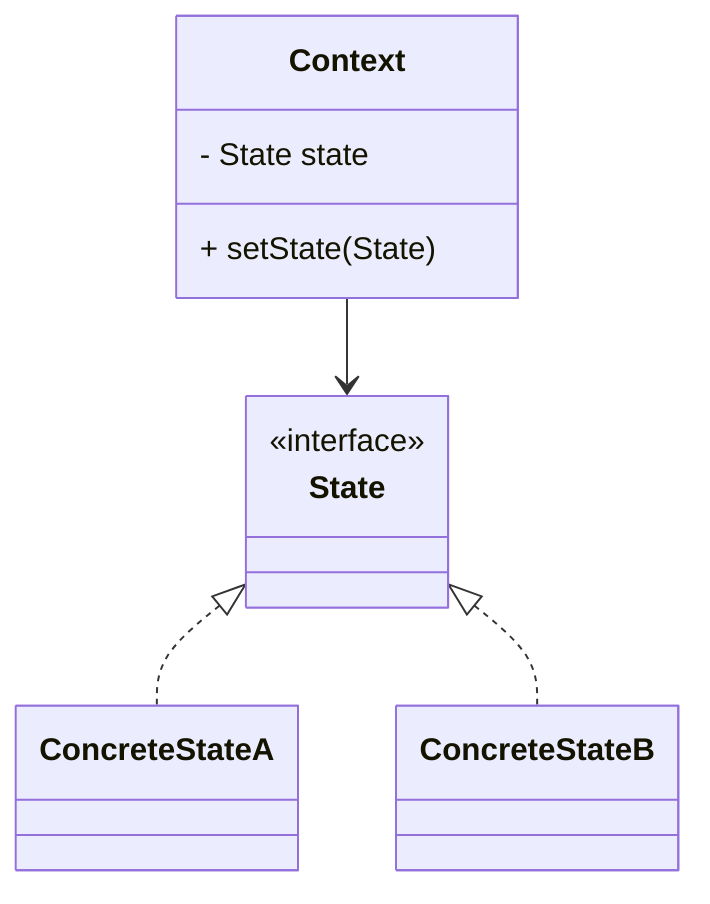
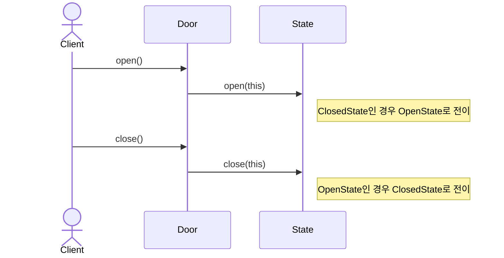
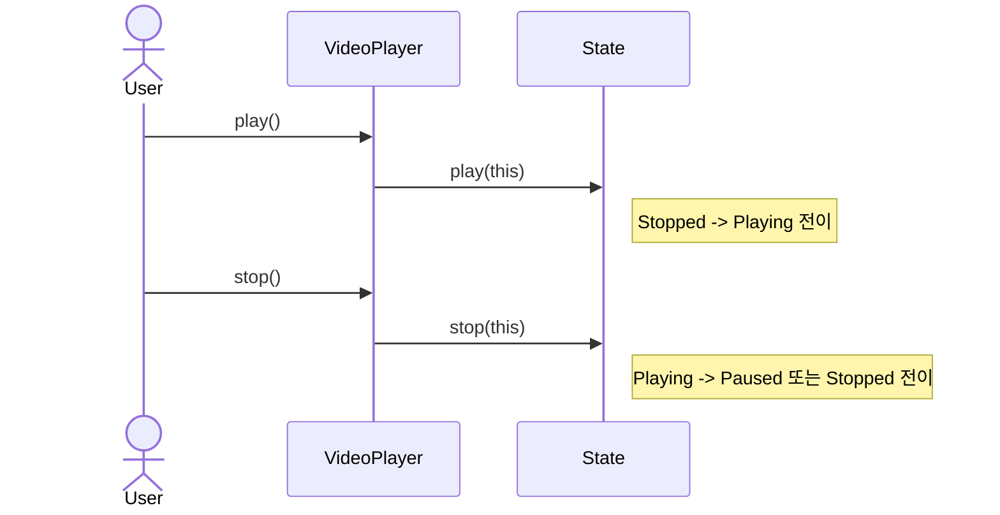

# State (상태) 패턴

객체의 내부 상태에 따라 행동이 달라지며, 상태 전환을 객체로 캡슐화해 복잡한 조건문 없이 동작을 교체하는 패턴입니다.

## 의도
- 상태에 따른 행동 변화를 상태 객체로 위임
- if/else, switch 제거: 다형성으로 분기 처리
- 런타임 상태 전환으로 유연성과 응집도 향상

## 구조

## 예시 1: 문(Door) 상태 (door)

구성 요소
- `State` 인터페이스: `open(Door)`, `close(Door)` 동작 정의
- `OpenState` / `ClosedState`: 각 상태별 동작과 전이 책임 보유
- `Door` 컨텍스트: 현재 상태를 보유하고 요청을 상태에 위임, `setState()`로 전이

관련 경로 (after)
- `src/behavioral/state/after/door/State.java`
- `src/behavioral/state/after/door/OpenState.java`
- `src/behavioral/state/after/door/ClosedState.java`
- `src/behavioral/state/after/door/Door.java`
- `src/behavioral/state/after/door/Main.java`

## 예시 2: 동영상 플레이어 (video)

구성 요소
- `State` 인터페이스: `play(VideoPlayer)`, `stop(VideoPlayer)` 정의
- `PlayingState` / `PausedState` / `StoppedState`: 각 상태의 전이와 메시지를 담당
- `VideoPlayer` 컨텍스트: 현재 상태를 보유하고 상태 전이를 수행

관련 경로 (after)
- `src/behavioral/state/after/video/State.java`
- `src/behavioral/state/after/video/PlayingState.java`
- `src/behavioral/state/after/video/PausedState.java`
- `src/behavioral/state/after/video/StoppedState.java`
- `src/behavioral/state/after/video/VideoPlayer.java`

## Before vs After
- Before (조건문 기반): `src/behavioral/state/before/video/VideoPlayer.java`
  - 문제점: 상태별 분기가 한 클래스에 집중되어 if/else가 증가하고, 전이 규칙 변경 시 수정 범위가 커짐.
- After (상태 객체 기반): 위 ‘관련 경로 (after)’ 참고
  - 장점: 전이는 각 상태 객체로 응집되고, 컨텍스트는 위임과 현재 상태 보관에만 집중.

## 적용 팁
- 전이 규칙은 상태 객체에 두고, 컨텍스트는 위임과 현재 상태 보관에 집중
- 상태 객체가 불변이라면 싱글턴/캐싱으로 객체 생성 비용을 줄일 수 있음
- 전이 로깅/모니터링이 필요하면 `setState()` 단일 지점에서 훅을 제공
- 복잡한 전이 표가 있다면 전이 맵/팩토리로 생성·전이를 일관되게 관리
