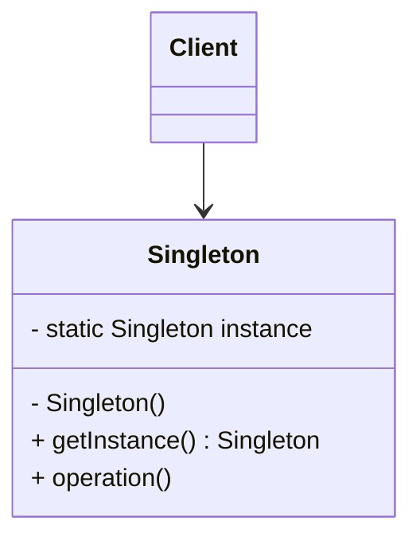
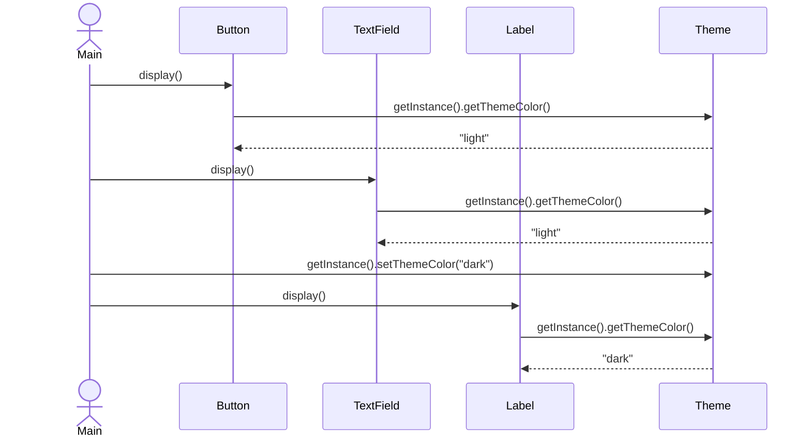

# Singleton (싱글턴) 패턴

애플리케이션 전역에서 단 하나의 인스턴스만 존재하도록 보장하고, 해당 인스턴스에 대한 전역 접근 지점을 제공하는 패턴입니다.

## 의도
- 단일 인스턴스 보장: 상태/리소스를 하나로 중앙화해 일관성 유지
- 전역 접근 지점 제공: 어디서든 동일 인스턴스를 획득해 공유 상태 관리
- 생성 시점 제어: 지연(lazy) 또는 즉시(eager) 초기화 선택

## 구조

## 예시: Theme 관리 (UI 공용 테마)

여러 UI 컴포넌트가 공용 `Theme` 인스턴스를 조회해 동일한 테마 색상을 사용합니다.

구성 요소
- `Theme`: 싱글턴 인스턴스. `getInstance()`로 전역 접근, `themeColor` 상태 보유
- `Button` / `TextField` / `Label`: 각 컴포넌트가 필요 시 `Theme`를 조회해 표시 로직에 반영

관련 경로
- `src/creational/singleton/resolve/theme/Theme.java`
- `src/creational/singleton/resolve/theme/Button.java`
- `src/creational/singleton/resolve/theme/TextField.java`
- `src/creational/singleton/resolve/theme/Label.java`
- `src/creational/singleton/resolve/theme/Main.java`

## 스레드 안전과 변형
- 현재 구현은 지연 초기화(lazy)지만 스레드 안전하지 않음. 멀티스레드 환경에서 동시 접근 시 두 개 이상 생성 가능
- 대안
  - 단순 동기화: `synchronized`를 `getInstance()`에 사용 (간단하지만 호출 오버헤드)
  - 이중 검사 잠금(volatile): 성능과 안전성 균형
  - 정적 홀더(Initialization-on-demand holder): JVM 초기화 보장 활용
  - enum 싱글턴: 직렬화/리플렉션 안전성 측면에서 가장 단순하고 안전

## 적용 팁
- 글로벌 상태 남용 주의: 테스트 격리를 위해 리셋 훅 제공 또는 설계를 DI로 전환 검토
- 라이프사이클 명확화: 앱 시작/종료와 함께 자원 획득/해제를 일관되게 관리
- 필요 이상으로 싱글턴을 쓰지 않기: 무분별한 사용은 결합도 증가와 테스트 어려움 유발
