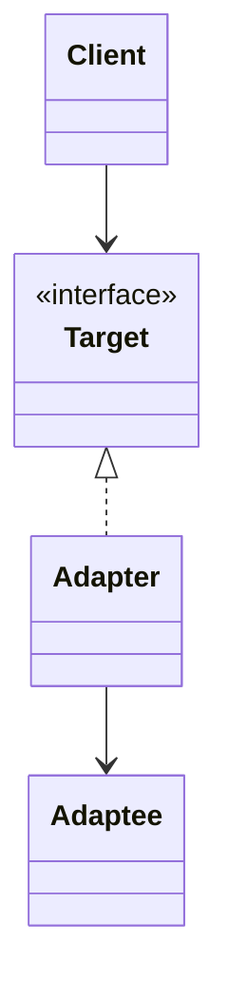
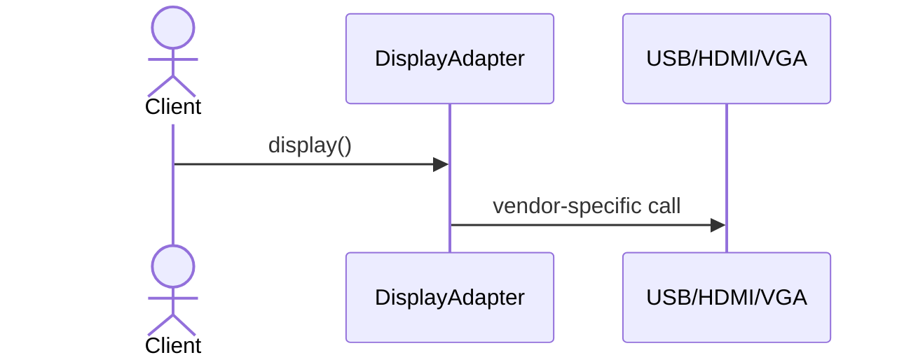
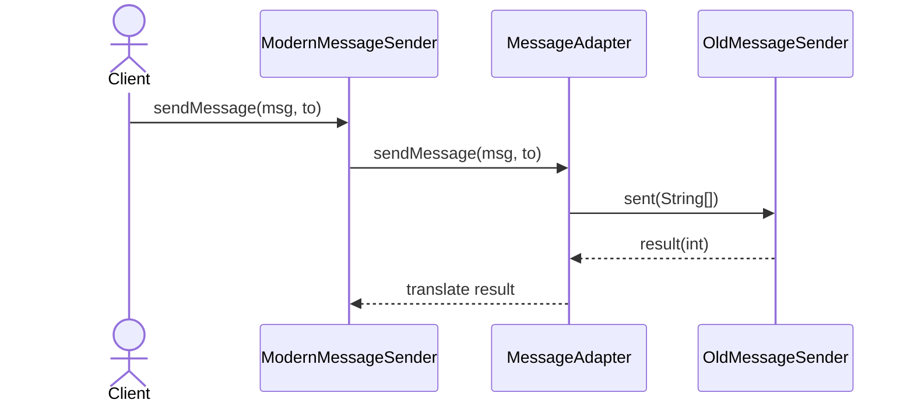

# Adapter (어댑터) 패턴

서로 다른 인터페이스를 가진 클래스를 클라이언트가 원하는 인터페이스로 맞춰 연결해 주는 패턴입니다. 기존(Adaptee)을 수정하지 않고 호환성을 제공합니다.

## 의도
- 호환성 제공: 변경 불가/어려운 기존 코드를 클라이언트 인터페이스에 맞춤
- 결합도 감소: 클라이언트는 Target(어댑터의 인터페이스)에만 의존
- 점진적 마이그레이션: 레거시와 신규 코드를 동시에 사용하며 단계적 전환

## 구조

## 예시 1: Display 어댑터 (display)

상황
- 서로 다른 디스플레이 규격(USB/HDMI/VGA)이 제각각의 메서드 시그니처를 가짐
- 클라이언트는 이를 단일한 `DisplayAdapter` 인터페이스로 다루고 싶음

흐름(Resolve)

관련 경로
- Resolve
  - `src/structural/adapter/resolve/display/DisplayAdapter.java`
  - `src/structural/adapter/resolve/display/USB.java`
  - `src/structural/adapter/resolve/display/USBAdapter.java`
  - `src/structural/adapter/resolve/display/HDMI.java`
  - `src/structural/adapter/resolve/display/HDMIAdapter.java`
  - `src/structural/adapter/resolve/display/VGA.java`
  - `src/structural/adapter/resolve/display/VGAAdapter.java`
  - `src/structural/adapter/resolve/display/Main.java`
- Problem
  - `src/structural/adapter/problem/display/USB.java`
  - `src/structural/adapter/problem/display/HDMI.java`
  - `src/structural/adapter/problem/display/VGA.java`
  - `src/structural/adapter/problem/display/Client.java`

문제점(Problem)
- 각 규격 메서드/파라미터가 달라 호출부가 중복/분기 증가
- 신규 규격 추가 시 클라이언트 수정 필요(개방-폐쇄 위배)

개선점(Resolve)
- `DisplayAdapter`로 추상화하여 클라이언트는 `display()`만 호출
- 개별 규격은 어댑터로 캡슐화되어 교체/확장이 쉬움

## 예시 2: 메시지 발송 어댑터 (sender)

상황
- 레거시 시스템은 `String[]`와 반환 코드 기반의 API를 노출함(Adaptee)
- 신규 클라이언트는 타입 안정적인 `sendMessage(String, String)` 인터페이스를 원함(Target)

흐름(Resolve)

관련 경로
- Resolve
  - `src/structural/adapter/resolve/sender/ModernMessageSender.java`
  - `src/structural/adapter/resolve/sender/OldMessageSender.java`
  - `src/structural/adapter/resolve/sender/OldMessageSystem.java`
  - `src/structural/adapter/resolve/sender/MessageAdapter.java`
  - `src/structural/adapter/resolve/sender/Main.java`
- Problem
  - `src/structural/adapter/problem/sender/OldMessageSender.java`
  - `src/structural/adapter/problem/sender/OldMessageSystem.java`
  - `src/structural/adapter/problem/sender/Client.java`

문제점(Problem)
- 클라이언트가 배열 순서/반환 코드 의미를 직접 알아야 함
- API 오사용 가능성 증가, 테스트/이식성 저하

개선점(Resolve)
- 의도를 드러내는 메서드 시그니처로 안전성 향상
- 어댑터 내에서 변환/에러 처리 일원화

## 적용 팁
- 클래스 어댑터(상속) vs 객체 어댑터(합성): 다중 상속 제약이 있다면 합성 선호
- 변환 로직은 어댑터에 집중시키고, Target 인터페이스는 작고 명확하게 유지
- 점진적 마이그레이션 시 어댑터를 통해 신규 코드로 경로를 통일하면 전환 비용 감소
