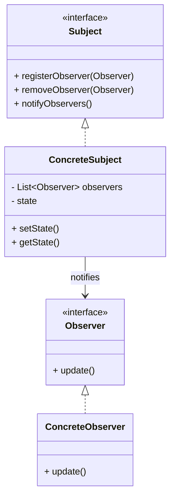
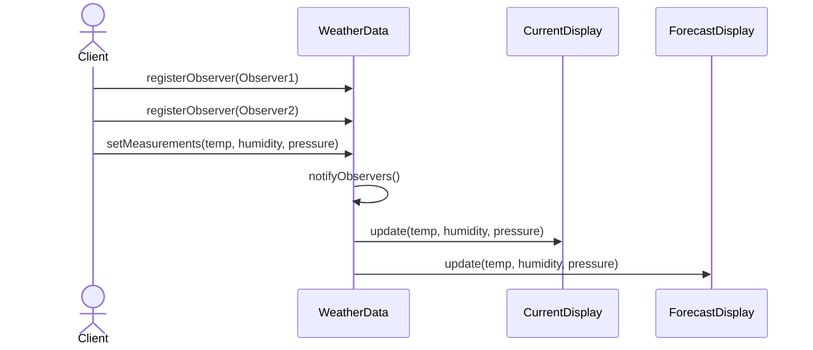
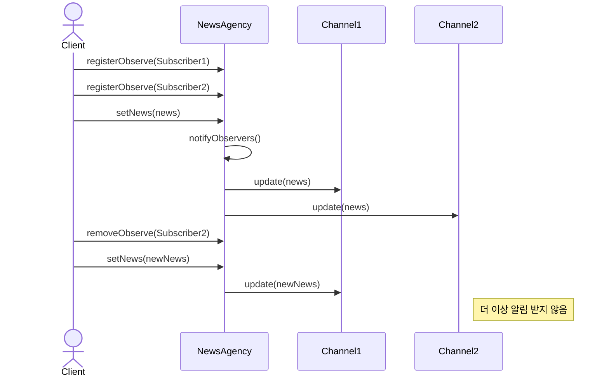

# Observer (옵져버) 패턴

객체 사이에 일대다 의존 관계를 정의하여, 한 객체의 상태가 변경되면 그 객체에 의존하는 모든 객체들이 자동으로 알림을 받고 업데이트되는 패턴입니다.

## 의도
- 객체 간의 느슨한 결합을 유지하면서 상태 변화를 통지
- 일대다 의존성 관리를 통한 데이터 일관성 유지
- 런타임에 관찰자를 동적으로 추가/제거 가능
- 브로드캐스트 방식의 통신 제공

## 구조

## 예시 1: 날씨 정보 시스템 (weather)

구성 요소
- `WeatherStation` 인터페이스: 주제(Subject)의 공통 인터페이스 정의
- `WeatherData`: 날씨 데이터를 관리하고 관찰자들에게 알림
- `WeatherObserver` 인터페이스: 관찰자의 공통 인터페이스 정의
- `CurrentConditionsDisplay` / `ForecastDisplay`: 구체적인 날씨 디스플레이들

관련 경로 (resolve)
- `src/behavioral/observer/resolve/weather/WeatherStation.java`
- `src/behavioral/observer/resolve/weather/WeatherData.java`
- `src/behavioral/observer/resolve/weather/WeatherObserver.java`
- `src/behavioral/observer/resolve/weather/CurrentConditionsDisplay.java`
- `src/behavioral/observer/resolve/weather/ForecastDisplay.java`
- `src/behavioral/observer/resolve/weather/StatisticsDisplay.java`

## 예시 2: 뉴스 배급 시스템 (news)

구성 요소
- `Subject` 인터페이스: 발행자(Publisher)의 공통 인터페이스 정의
- `NewsAgency`: 뉴스를 발행하고 구독자들에게 배포
- `Observer` 인터페이스: 구독자(Subscriber)의 공통 인터페이스 정의
- `NewsChannel`: 뉴스를 수신하는 구체적인 채널들

관련 경로 (resolve)
- `src/behavioral/observer/resolve/news/Subject.java`
- `src/behavioral/observer/resolve/news/NewsAgency.java`
- `src/behavioral/observer/resolve/news/Observer.java`
- `src/behavioral/observer/resolve/news/NewsChannel.java`

## Problem vs Resolve
- Problem (직접 의존): `src/behavioral/observer/problem/`
  - 문제점: Subject가 모든 Observer를 직접 참조하여 강결합. 새로운 Observer 추가 시 Subject 코드 수정 필요. 동적 추가/제거 불가능.
- Resolve (옵져버 패턴): 위 '관련 경로 (resolve)' 참고
  - 장점: Subject와 Observer 간 느슨한 결합. 런타임에 Observer 동적 추가/제거 가능. OCP 준수로 확장성 확보.

## 패턴 변형
- **Push Model**: Subject가 모든 데이터를 Observer에게 전달 (현재 예시)
- **Pull Model**: Observer가 필요한 데이터를 Subject에서 직접 가져옴
- **Event-Driven**: 이벤트 기반으로 특정 조건에서만 알림 발송

## 적용 팁
- MVC 패턴에서 Model-View 간 통신에 활용
- GUI 이벤트 처리, 모델 데이터 변경 통지에 유용
- 메모리 누수 방지를 위해 Observer 제거 메커니즘 필수
- Java의 Observable/Observer는 deprecated되었으므로 직접 구현 권장
- 비동기 처리가 필요한 경우 별도 스레드 풀 고려