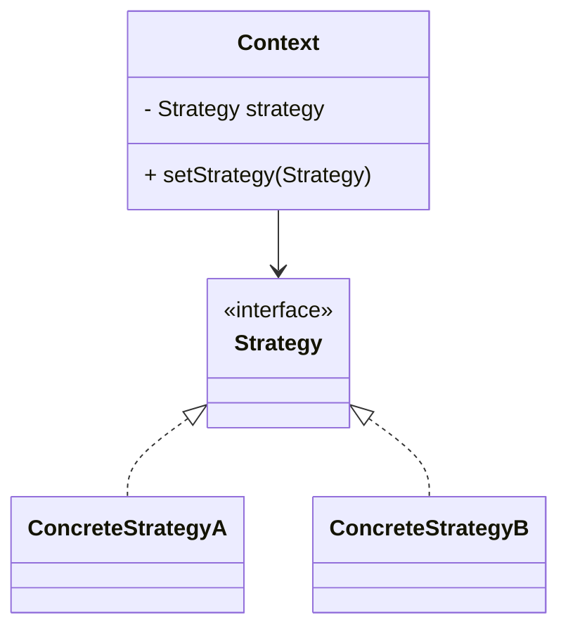
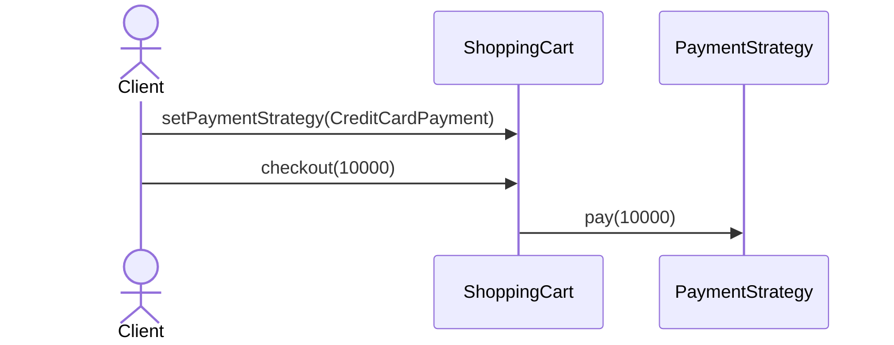
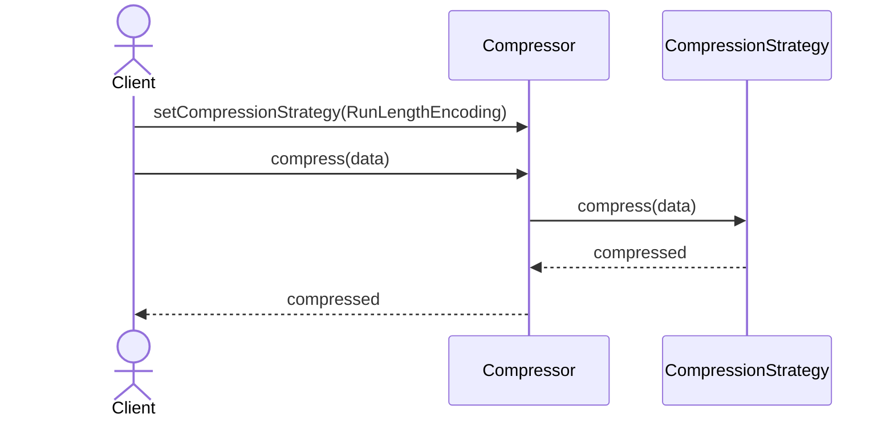

# Strategy (전략) 패턴

여러 알고리즘(전략)을 캡슐화하고, 런타임에 교체 가능하게 만드는 패턴입니다. 클라이언트는 공통 인터페이스에만 의존하고, 구체 알고리즘은 컨텍스트 밖에서 주입합니다.

## 의도
- 알고리즘을 구현체로 분리해 교체와 확장을 용이하게 함
- 조건문 분기 제거: 다형성으로 분기 처리
- 실행 중 전략 교체로 유연성 확보

## 구조

## 예시 1: 결제 전략 (payment)

구성 요소
- `PaymentStrategy` 인터페이스, `CreditCardPayment`, `PayPalPayment` 구현체
- `ShoppingCart` 컨텍스트: 전략을 주입받아 `checkout()` 시 위임

관련 경로
- `src/behavioral/strategy/payment/PaymentStrategy.java`
- `src/behavioral/strategy/payment/CreditCardPayment.java`
- `src/behavioral/strategy/payment/PayPalPayment.java`
- `src/behavioral/strategy/payment/ShoppingCart.java`

## 예시 2: 압축 전략 (compress)

구성 요소
- `CompressionStrategy` 인터페이스, `RunLengthEncoding`, `SimpleReplacementCompression` 구현체
- `Compressor` 컨텍스트: 전략을 주입받아 `compress()` 시 위임

관련 경로
- `src/behavioral/strategy/compress/CompressionStrategy.java`
- `src/behavioral/strategy/compress/RunLengthEncoding.java`
- `src/behavioral/strategy/compress/SimpleReplacementCompression.java`
- `src/behavioral/strategy/compress/Compressor.java`

## 적용 팁
- 전략 교체가 빈번하면 세터/생성자 주입 모두 허용해 테스트/사용 편의성 확보
- 공통 전처리/후처리가 필요하면 컨텍스트에서 다루고, 핵심 알고리즘만 전략에 두기
