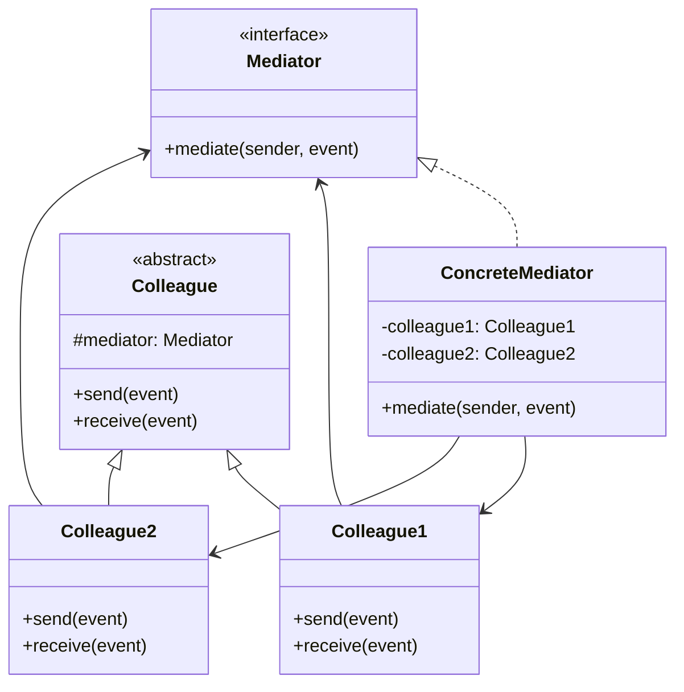
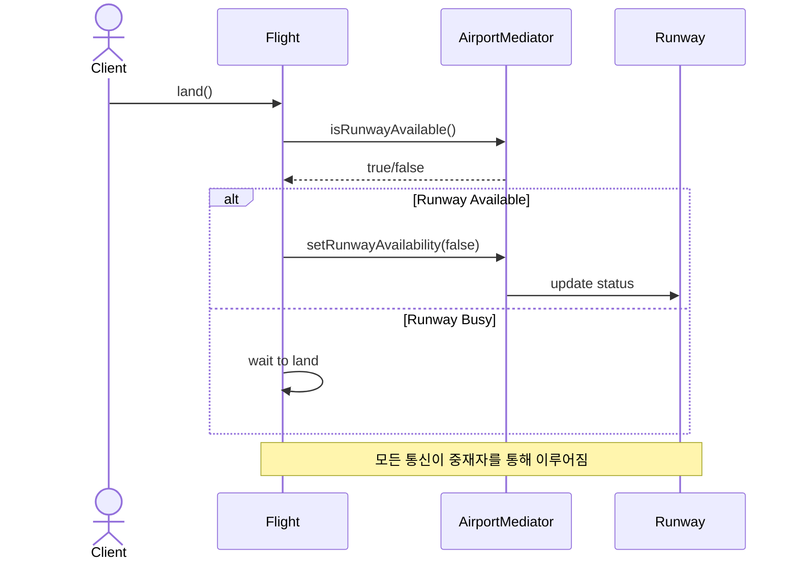
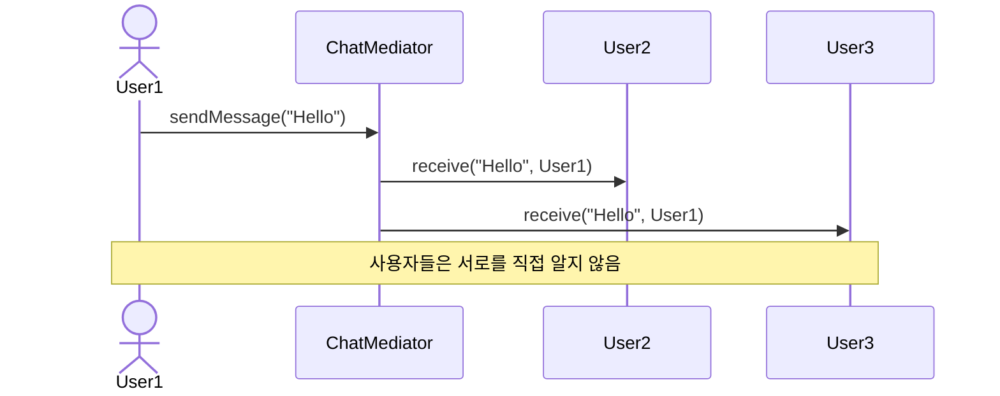

# Mediator (중재자) 패턴

객체 간의 상호작용을 캡슐화하여 객체들 사이의 직접적인 통신을 방지하고, 중앙집중식 제어를 통해 결합도를 낮추는 패턴입니다.

## 의도
- 결합도 감소: 객체들이 서로 직접 참조하지 않고 중재자를 통해 통신
- 상호작용 중앙화: 복잡한 상호작용 로직을 중재자에 집중시켜 관리 용이성 향상
- 재사용성 증대: 개별 객체들이 독립적이어서 다른 맥락에서 재사용 가능

## 구조

## 예시 1: 공항 관제 시스템 (airport)

상황
- 비행기들이 활주로 사용 상태를 서로 확인해야 함
- 활주로와 비행기들 간의 복잡한 상호작용 필요
- 직접 통신 시 객체들 간의 강한 결합 발생

흐름(Resolve)

관련 경로
- Resolve
  - `src/behavioral/mediator/resolve/airport/AirportMediator.java`
  - `src/behavioral/mediator/resolve/airport/AirportControlTower.java`
  - `src/behavioral/mediator/resolve/airport/Flight.java`
  - `src/behavioral/mediator/resolve/airport/Runway.java`
  - `src/behavioral/mediator/resolve/airport/AirportClient.java`
- Problem
  - `src/behavioral/mediator/problem/airport/Flight.java`
  - `src/behavioral/mediator/problem/airport/Runway.java`
  - `src/behavioral/mediator/problem/airport/Client.java`

문제점(Problem)
- 비행기가 활주로의 내부 상태를 직접 알아야 함
- 객체들 간의 직접적인 의존관계로 인한 강한 결합
- 클라이언트에서 복잡한 상호작용을 직접 관리해야 함

개선점(Resolve)
- AirportControlTower(중재자)가 모든 상호작용을 중앙 관리
- Flight와 Runway는 서로를 직접 알지 않아도 됨
- 새로운 항공기 타입이나 활주로 추가 시 중재자만 수정하면 됨

## 예시 2: 채팅 시스템 (chat)

상황
- 여러 사용자가 참여하는 채팅방
- 사용자들이 서로에게 메시지를 전송해야 함
- 직접 통신 시 N-to-N 관계로 복잡성 증가

흐름(Resolve)

관련 경로
- Resolve
  - `src/behavioral/mediator/resolve/chat/ChatMediator.java`
  - `src/behavioral/mediator/resolve/chat/ChatMediatorImpl.java`
  - `src/behavioral/mediator/resolve/chat/User.java`
  - `src/behavioral/mediator/resolve/chat/UserImpl.java`
  - `src/behavioral/mediator/resolve/chat/Client.java`
- Problem
  - `src/behavioral/mediator/problem/chat/User.java`
  - `src/behavioral/mediator/problem/chat/Client.java`

문제점(Problem)
- 각 사용자가 다른 모든 사용자에 대한 참조를 가져야 함
- 사용자 추가/제거 시 모든 관련 객체 수정 필요
- 메시지 전송 로직이 사용자 객체에 분산되어 있음

개선점(Resolve)
- ChatMediator가 모든 사용자 관리와 메시지 전송 담당
- 사용자들은 서로를 직접 알 필요 없이 중재자와만 통신
- 메시지 필터링, 로깅 등의 기능을 중재자에서 일원화 가능

## Observer vs Mediator

| 특징 | Observer | Mediator |
|------|----------|----------|
| 통신 방향 | 일대다 (1:N) | 다대다 (N:N) |
| 결합도 | Subject-Observer 결합 | Colleague들 간 결합 제거 |
| 제어 흐름 | Subject가 알림 주도 | Mediator가 상호작용 조율 |
| 사용 목적 | 상태 변화 알림 | 복잡한 상호작용 관리 |

## 적용 팁
- 객체들 간의 상호작용이 복잡하고 잘 정의되어 있을 때 적용
- GUI 컴포넌트들 간의 상호작용 관리에 특히 유용
- 중재자가 너무 복잡해지지 않도록 단일 책임 원칙 준수
- 필요시 여러 개의 작은 중재자로 분할하여 관리