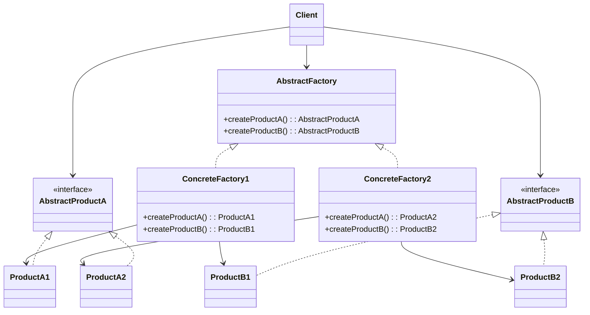
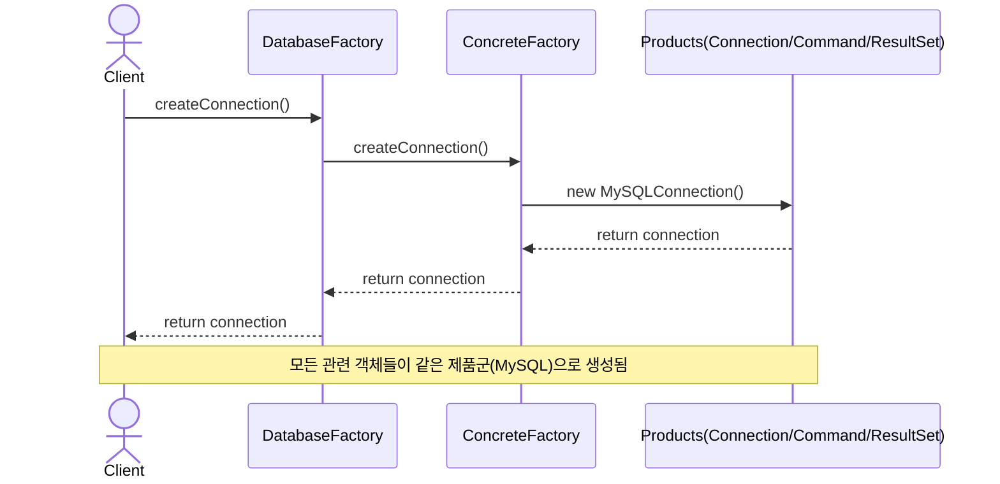

# Abstract Factory (추상 팩토리) 패턴

관련된 객체들의 집합을 일관성 있게 생성하는 인터페이스를 제공하는 패턴입니다. 서로 다른 제품군의 객체들을 생성할 때 일관성을 보장합니다.

## 의도
- 제품군 일관성: 관련된 객체들을 함께 생성하여 호환성 보장
- 구체 클래스 분리: 클라이언트는 추상 팩토리에만 의존하여 구체 구현체로부터 분리
- 제품군 교체 용이성: 전체 제품군을 한 번에 교체 가능

## 구조

## 예시: 데이터베이스 연결 시스템

상황
- 여러 데이터베이스 벤더(MySQL, PostgreSQL)를 지원해야 함
- 각 벤더마다 Connection, Command, ResultSet이 서로 다른 구현을 가짐
- 클라이언트는 특정 벤더에 종속되지 않고 일관된 방식으로 사용하고 싶음

흐름(Resolve)

관련 경로
- Resolve
  - `src/creational/abstractFactory/resolve/DatabaseFactory.java`
  - `src/creational/abstractFactory/resolve/MySQLFactory.java`
  - `src/creational/abstractFactory/resolve/PostgreSQLFactory.java`
  - `src/creational/abstractFactory/resolve/Connection.java`
  - `src/creational/abstractFactory/resolve/Command.java`
  - `src/creational/abstractFactory/resolve/ResultSet.java`
  - `src/creational/abstractFactory/resolve/DatabaseClient.java`
  - `src/creational/abstractFactory/resolve/Client.java`
- Problem
  - `src/creational/abstractFactory/problem/DatabaseClient.java`
  - `src/creational/abstractFactory/problem/MySQLConnection.java`
  - `src/creational/abstractFactory/problem/MySQLCommand.java`
  - `src/creational/abstractFactory/problem/MySQLResultSet.java`
  - `src/creational/abstractFactory/problem/PostgreSQLConnection.java`
  - `src/creational/abstractFactory/problem/PostgreSQLCommand.java`
  - `src/creational/abstractFactory/problem/PostgreSQLResultSet.java`
  - `src/creational/abstractFactory/problem/Client.java`

문제점(Problem)
- 클라이언트가 모든 구체 클래스들을 직접 알고 있어야 함
- 데이터베이스 타입별로 분기 처리가 필요하여 코드 복잡도 증가
- 새로운 데이터베이스 벤더 추가 시 클라이언트 코드 수정 필요 (개방-폐쇄 원칙 위배)
- 관련 객체들 간의 일관성을 보장하기 어려움

개선점(Resolve)
- `DatabaseFactory` 추상화를 통해 클라이언트는 구체 구현체로부터 분리
- 팩토리 교체만으로 전체 제품군(Connection, Command, ResultSet) 일괄 변경
- 새로운 데이터베이스 벤더 추가 시 새로운 팩토리만 구현하면 됨
- 관련 객체들이 같은 제품군으로 생성되어 호환성 보장

## Factory Method vs Abstract Factory

| 특징 | Factory Method | Abstract Factory |
|------|----------------|------------------|
| 목적 | 하나의 객체 생성 | 관련 객체들의 집합 생성 |
| 구조 | 메서드 수준의 팩토리 | 클래스 수준의 팩토리 |
| 사용 시기 | 단일 제품의 생성 방식 캡슐화 | 제품군의 일관성 있는 생성 |

## 적용 팁
- 관련된 제품들이 함께 사용되어야 할 때 적용
- 시스템이 여러 제품군 중 하나를 선택해서 사용해야 할 때 유용
- 제품군의 일관성이 중요한 시스템에서 활용
- 구성보다는 생성에 중점을 둔 팩토리 메서드의 확장된 형태로 이해