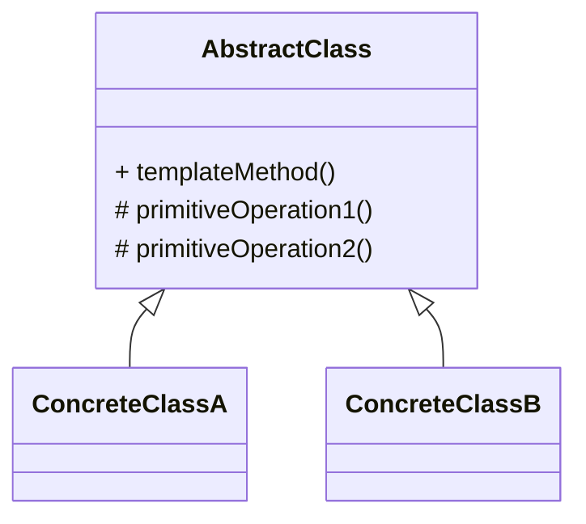
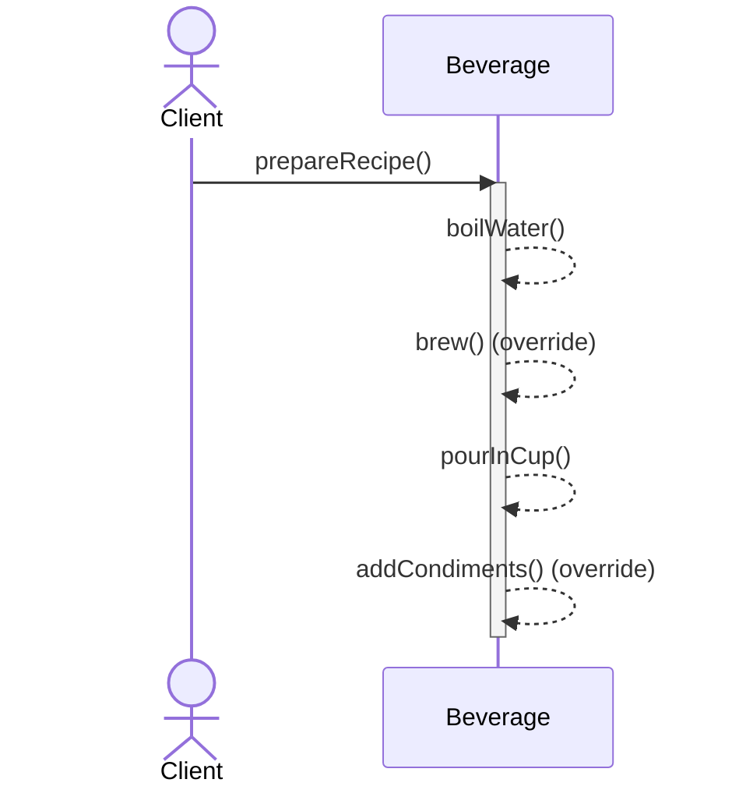
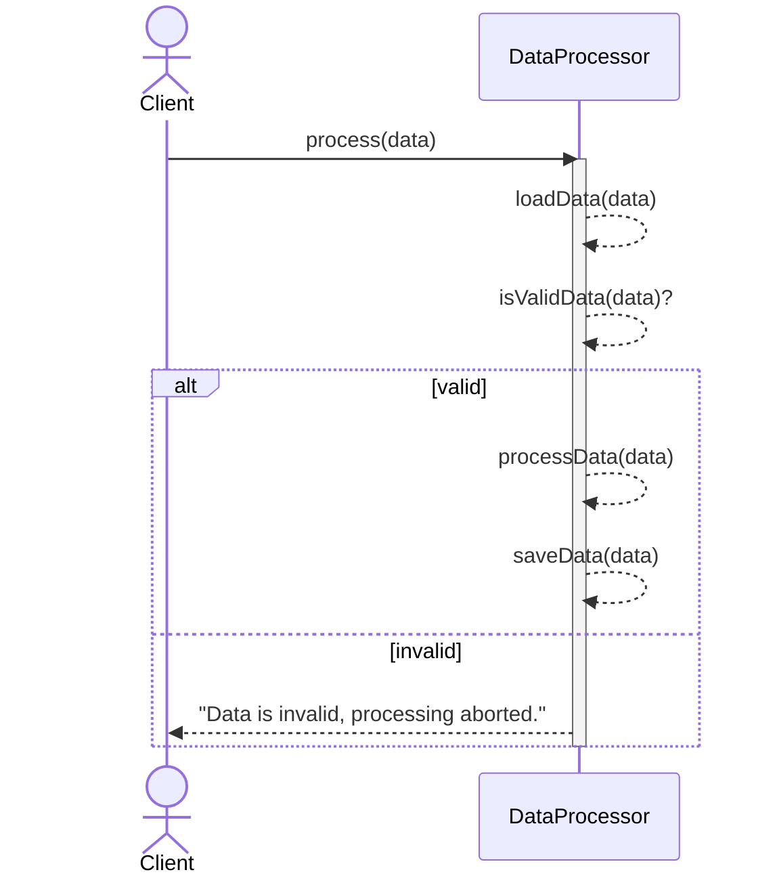

# Template Method (템플릿 메소드) 패턴

알고리즘의 골격(흐름)을 상위 클래스의 템플릿 메소드로 고정하고, 세부 단계만 하위 클래스가 구현/확장하도록 하는 패턴입니다. 공통 흐름을 강제하면서도 단계별 커스터마이징이 가능합니다.

## 의도
- 공통 절차 강제: 순서와 필수 단계를 한 곳에 고정해 일관성 확보
- 중복 제거: 변하는 부분만 하위 클래스로 분리하여 재사용성 향상
- 확장 지점 제공: 훅(hook) 또는 추상 메소드로 단계별 커스터마이징

## 구조

`templateMethod()`는 final로 두어 알고리즘 순서가 바뀌지 않도록 하는 것이 일반적입니다.

## 예시 1: 음료 제조 (beverage)

구성 요소
- `Beverage` 추상 클래스: `prepareRecipe()`가 템플릿. `boilWater` → `brew` → `pourInCup` → `addCondiments`
- `Tea` / `Coffee`: `brew`, `addCondiments`를 구체화

관련 경로
- `src/behavioral/templateMethod/beverage/Beverage.java`
- `src/behavioral/templateMethod/beverage/Tea.java`
- `src/behavioral/templateMethod/beverage/Coffee.java`
- `src/behavioral/templateMethod/beverage/Main.java`

## 예시 2: 데이터 처리 파이프라인 (processor)

구성 요소
- `DataProcessor` 추상 클래스: `process(String data)`가 템플릿. `loadData` → `isValidData` → `processData` → `saveData`
- `CSVDataProcessor` / `JSONDataProcessor`: 각 단계 구현체

관련 경로
- `src/behavioral/templateMethod/processor/DataProcessor.java`
- `src/behavioral/templateMethod/processor/CSVDataProcessor.java`
- `src/behavioral/templateMethod/processor/JSONDataProcessor.java`
- `src/behavioral/templateMethod/processor/Main.java`

## 적용 팁
- 템플릿 메소드는 가능하면 `final`로 고정해 흐름 변경을 방지
- 공통 전/후처리는 상위 클래스에서, 변동 단계만 하위 클래스로 이동
- 훅(hook) 메소드(디폴트 no-op 혹은 boolean 플래그)를 두면 선택적 단계를 유연하게 제어 가능
- 템플릿 내부에서 예외 처리/로그를 일원화하면 일관된 관찰 가능성 확보
