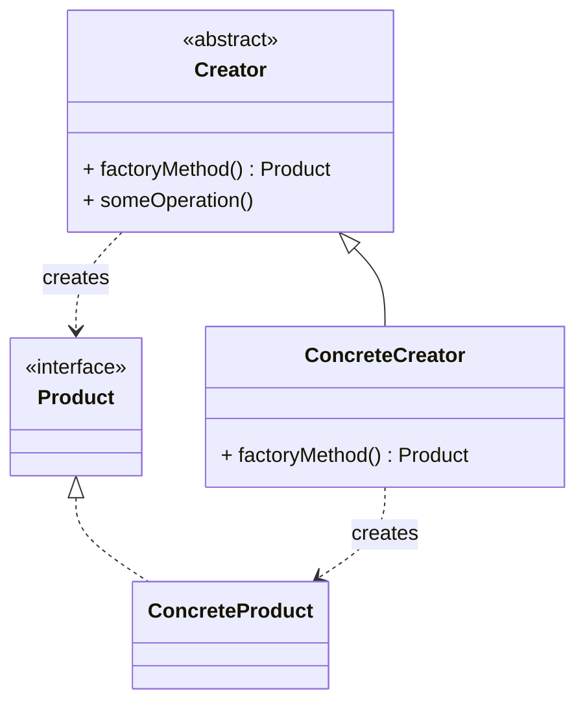
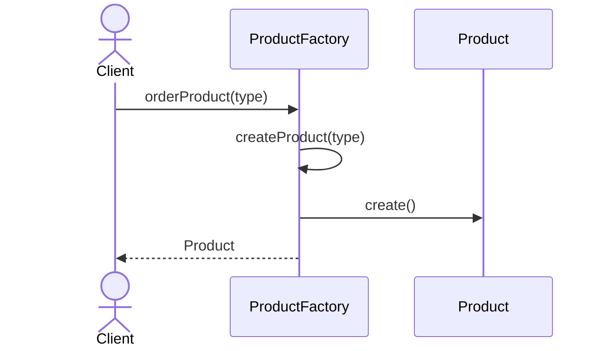
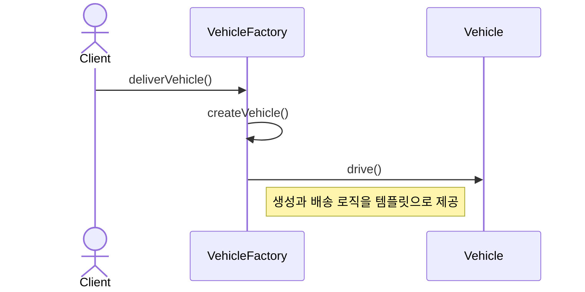

# Factory Method (팩토리 메소드) 패턴

객체를 생성하는 인터페이스는 정의하지만, 어떤 클래스의 인스턴스를 생성할지는 서브클래스가 결정하도록 하는 패턴입니다.

## 의도
- 객체 생성 로직을 서브클래스에 위임하여 결합도 감소
- 확장에는 열려있고 수정에는 닫혀있는 구조 제공 (OCP)
- 객체 생성과 사용을 분리하여 유연성 증대
- 클라이언트 코드가 구체 클래스에 의존하지 않도록 함

## 구조

## 예시 1: 제품 생성 시스템 (product)

구성 요소
- `ProductFactory` 추상 클래스: 팩토리 메소드와 공통 로직 정의
- `ConcreteProductFactory`: 구체적인 제품 생성 로직 구현
- `Product` 인터페이스: 생성될 제품의 공통 인터페이스
- `Electronics` / `Clothing` / `Book`: 구체적인 제품들

관련 경로 (resolve)
- `src/creational/fatoryMethod/resolve/product/ProductFactory.java`
- `src/creational/fatoryMethod/resolve/product/ConcreteProductFactory.java`
- `src/creational/fatoryMethod/resolve/product/Product.java`
- `src/creational/fatoryMethod/resolve/product/Electronics.java`
- `src/creational/fatoryMethod/resolve/product/Clothing.java`
- `src/creational/fatoryMethod/resolve/product/Book.java`

## 예시 2: 차량 배송 시스템 (vehicle)

구성 요소
- `VehicleFactory` 추상 클래스: 차량 생성과 배송 로직의 템플릿 제공
- `CarFactory` / `MotorcycleFactory`: 구체적인 차량 생성 팩토리들
- `Vehicle` 인터페이스: 차량의 공통 인터페이스
- `Car` / `Motorcycle`: 구체적인 차량들

관련 경로 (resolve)
- `src/creational/fatoryMethod/resolve/vehicle/VehicleFactory.java`
- `src/creational/fatoryMethod/resolve/vehicle/CarFactory.java`
- `src/creational/fatoryMethod/resolve/vehicle/MotorcycleFactory.java`
- `src/creational/fatoryMethod/resolve/vehicle/Vehicle.java`
- `src/creational/fatoryMethod/resolve/vehicle/Car.java`
- `src/creational/fatoryMethod/resolve/vehicle/Motorcycle.java`

## Problem vs Resolve
- Problem (중앙집중식 생성): `src/creational/fatoryMethod/problem/`
  - 문제점: 모든 객체 생성 로직이 한 클래스에 집중되어 OCP 위반. 새로운 타입 추가 시 기존 코드 수정 필요.
- Resolve (팩토리 메소드): 위 '관련 경로 (resolve)' 참고
  - 장점: 객체 생성을 서브클래스에 위임하여 확장성 확보. 새로운 타입 추가 시 새로운 팩토리만 생성하면 됨.

## 적용 팁
- 객체 생성 로직이 복잡하거나 자주 변경될 때 유용
- 프레임워크에서 애플리케이션별 객체 생성을 위임할 때 사용
- Simple Factory보다 확장성이 뛰어나지만 클래스 수가 증가
- Abstract Factory와 달리 하나의 제품군에 집중
- Template Method 패턴과 함께 사용되는 경우가 많음