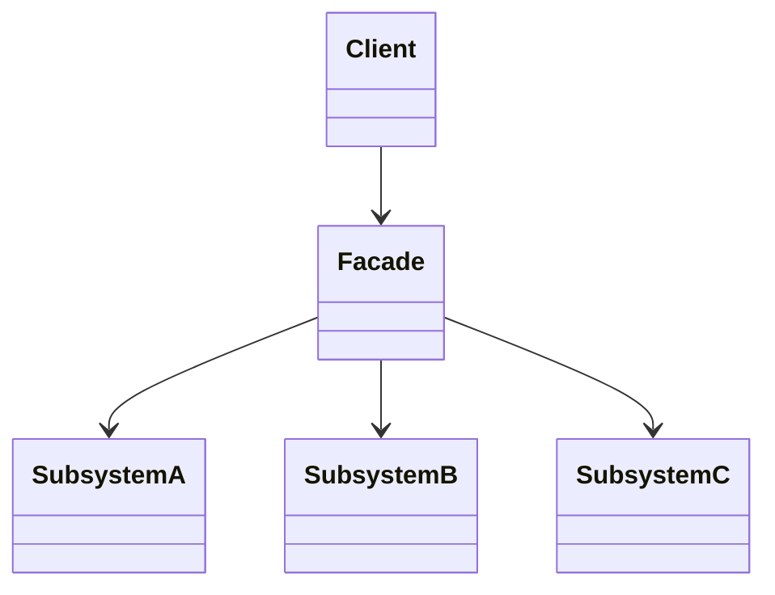
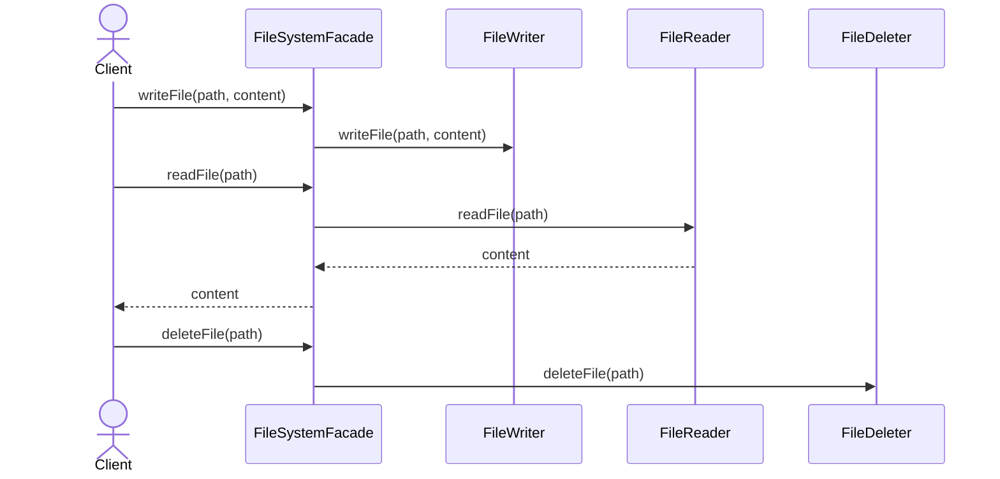
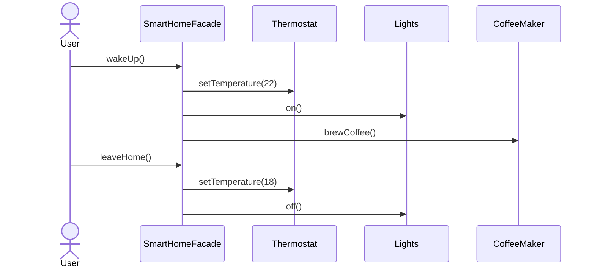

# Facade (파사드) 패턴

여러 서브시스템(컴포넌트)에 대한 단순화된 통합 인터페이스를 제공해, 클라이언트가 복잡한 의존성을 몰라도 작업을 수행할 수 있게 하는 패턴입니다.

## 의도
- 복잡성 캡슐화: 서브시스템의 세부 구현을 숨김
- 결합도 감소: 클라이언트는 파사드에만 의존
- 점진적 확장: 내부 컴포넌트 추가/교체가 클라이언트에 영향 최소화

## 구조

## FileSystemFacade 흐름

구성 요소
- `FileSystemFacade`: 클라이언트 진입점. 에러 처리와 컴포넌트 조합 담당
- `FileReader` / `FileWriter` / `FileDeleter`: 각각 읽기/쓰기/삭제 책임 분리

관련 경로
- `src/structural/facade/resolve/filesystem/FileSystemFacade.java`
- `src/structural/facade/resolve/filesystem/FileReader.java`
- `src/structural/facade/resolve/filesystem/FileWriter.java`
- `src/structural/facade/resolve/filesystem/FileDeleter.java`

## SmartHomeFacade 흐름

구성 요소
- `SmartHomeFacade`: 시나리오 단위 오케스트레이션
- `Thermostat` / `Lights` / `CoffeeMaker`: 각 하드웨어 제어 책임

관련 경로
- `src/structural/facade/resolve/smarthome/SmartHomeFacade.java`
- `src/structural/facade/resolve/smarthome/Thermostat.java`
- `src/structural/facade/resolve/smarthome/Lights.java`
- `src/structural/facade/resolve/smarthome/CoffeeMaker.java`

## 적용 팁
- 파사드 내부에서 예외/로그/트랜잭션 등 횡단 관심사를 모아 처리하면 클라이언트 간소화에 효과적
- 하위 서브시스템의 변경을 파사드에서 흡수해 외부 API를 안정적으로 유지
- 테스트 시 파사드를 단위로 목킹하면 시나리오 테스트가 단순해짐
