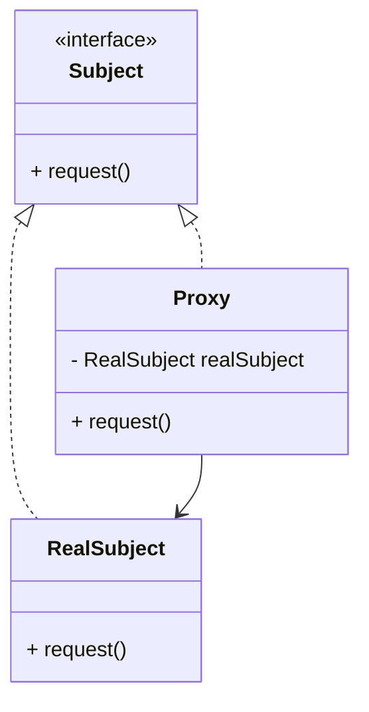
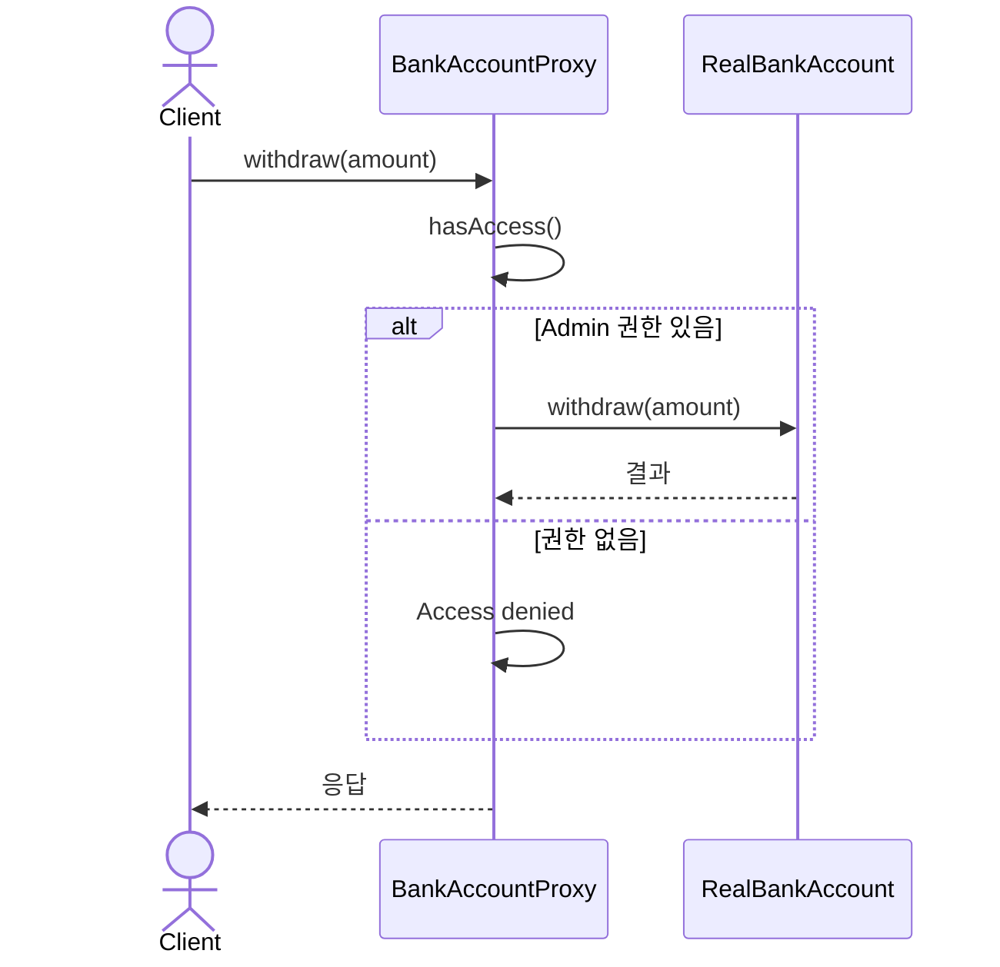
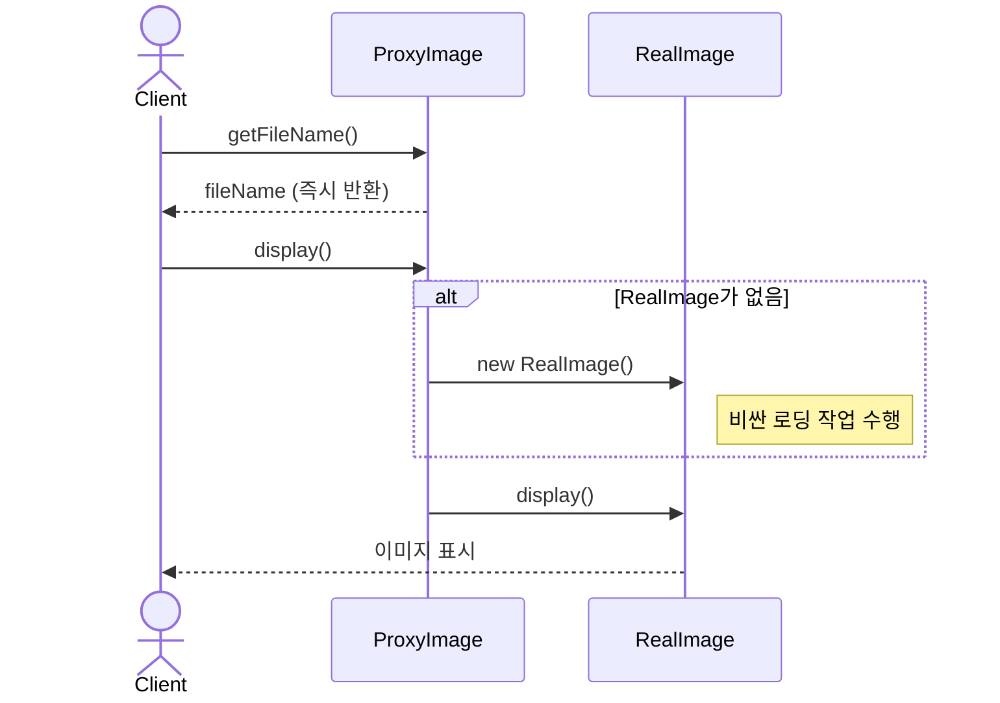

# Proxy (프록시) 패턴

다른 객체에 대한 접근을 제어하기 위해 대리자나 자리표시자 역할을 하는 패턴입니다.

## 의도
- 객체에 대한 접근을 제어하여 보안, 성능, 복잡성 관리
- 실제 객체 생성을 지연시켜 리소스 절약 (Lazy Loading)
- 실제 객체에 부가 기능 제공 (로깅, 캐싱, 접근 제어 등)
- 클라이언트와 실제 객체 사이의 중간 계층 역할

## 구조

## 예시 1: 은행 계좌 접근 제어 (bank)

구성 요소
- `BankAccount` 인터페이스: 계좌 조작의 공통 인터페이스
- `RealBankAccount`: 실제 계좌 비즈니스 로직을 담당
- `BankAccountProxy`: 접근 제어 및 권한 검증을 담당

관련 경로 (resolve)
- `src/structural/proxy/resolve/bank/BankAccount.java`
- `src/structural/proxy/resolve/bank/RealBankAccount.java`
- `src/structural/proxy/resolve/bank/BankAccountProxy.java`

## 예시 2: 이미지 지연 로딩 (image)

구성 요소
- `Image` 인터페이스: 이미지 조작의 공통 인터페이스
- `RealImage`: 실제 이미지 로딩과 표시를 담당
- `ProxyImage`: 지연 로딩과 메타데이터 접근을 담당

관련 경로 (resolve)
- `src/structural/proxy/resolve/image/Image.java`
- `src/structural/proxy/resolve/image/RealImage.java`
- `src/structural/proxy/resolve/image/ProxyImage.java`

## Problem vs Resolve
- Problem (직접 접근): `src/structural/proxy/problem/`
  - 문제점: 접근 제어와 비즈니스 로직이 섞임. 객체 생성 시 불필요한 리소스 로딩. 부가 기능 추가 시 핵심 클래스 수정 필요.
- Resolve (프록시 패턴): 위 '관련 경로 (resolve)' 참고
  - 장점: 관심사 분리로 SRP 준수. 지연 로딩으로 성능 향상. 부가 기능을 프록시에서 처리하여 핵심 로직 보호.

## 프록시 유형
- **Virtual Proxy**: 비싼 객체의 생성을 지연 (예: 이미지 지연 로딩)
- **Protection Proxy**: 접근 제어 및 권한 검증 (예: 은행 계좌 접근 제어)
- **Remote Proxy**: 원격 객체에 대한 로컬 대리자 (예: RPC, 웹 서비스)
- **Smart Reference**: 참조 카운팅, 캐싱 등 부가 기능 제공

## 적용 팁
- 실제 객체 생성 비용이 클 때 Virtual Proxy 활용
- 보안이 중요한 시스템에서 Protection Proxy로 접근 제어
- 데코레이터 패턴과 유사하지만 프록시는 생명주기 관리에 중점
- 캐싱, 로깅, 트랜잭션 등 AOP 관점에서 활용 가능