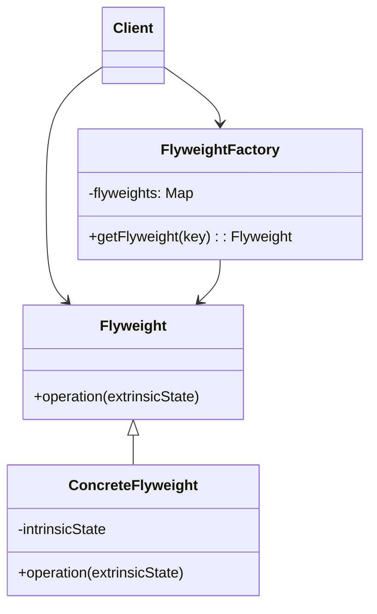
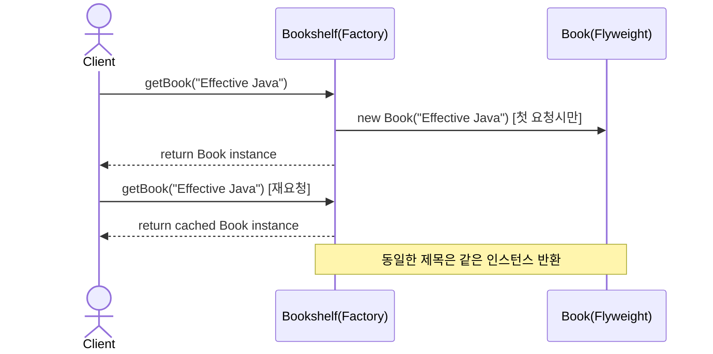

# Flyweight (플라이웨이트) 패턴

객체의 내부 상태를 공유하여 메모리 사용량을 최소화하는 패턴입니다. 동일한 상태를 가진 객체들을 재사용하여 성능을 향상시킵니다.

## 의도
- 메모리 최적화: 유사한 객체들의 공통 상태(intrinsic state)를 공유하여 메모리 사용량 감소
- 성능 향상: 객체 생성 비용을 줄이고 캐시 효과를 통한 성능 개선  
- 확장성: 대량의 유사 객체를 효율적으로 관리

## 구조

## 예시: 책 관리 시스템

상황
- 도서관 시스템에서 같은 제목의 책이 여러 권 있을 때
- 각 책마다 별도 객체를 생성하면 메모리 낭비 발생

흐름(Resolve)

관련 경로
- Resolve
  - `src/structural/flyweight/resolve/Book.java`
  - `src/structural/flyweight/resolve/Bookshelf.java`
  - `src/structural/flyweight/resolve/Client.java`
- Problem
  - `src/structural/flyweight/problem/Book.java`
  - `src/structural/flyweight/problem/Client.java`

문제점(Problem)
- 같은 제목의 책을 요청할 때마다 새로운 Book 객체 생성
- 메모리 낭비와 객체 생성 비용 증가
- 동일한 내용의 중복 데이터가 메모리에 반복 저장

개선점(Resolve)
- Bookshelf(Factory)가 Book 객체를 캐시하여 재사용
- 동일한 제목의 책은 같은 인스턴스 반환으로 메모리 절약
- 객체 생성 비용 감소 및 메모리 효율성 향상

## 핵심 개념

### Intrinsic State (내재 상태)
- 여러 객체가 공유할 수 있는 상태
- 변경되지 않는 데이터 (예: 책 제목, 폰트 정보)
- Flyweight 객체 내부에 저장

### Extrinsic State (외재 상태)  
- 각 객체마다 고유한 상태
- 클라이언트가 관리하고 메서드 호출 시 전달
- Flyweight 객체 외부에서 관리

## 적용 팁
- 대량의 유사 객체가 필요할 때 효과적
- 객체의 상태를 intrinsic/extrinsic으로 분리 가능한 경우 적용
- Factory 패턴과 함께 사용하여 객체 풀 관리
- 메모리 사용량이 성능에 중요한 영향을 미치는 시스템에서 활용